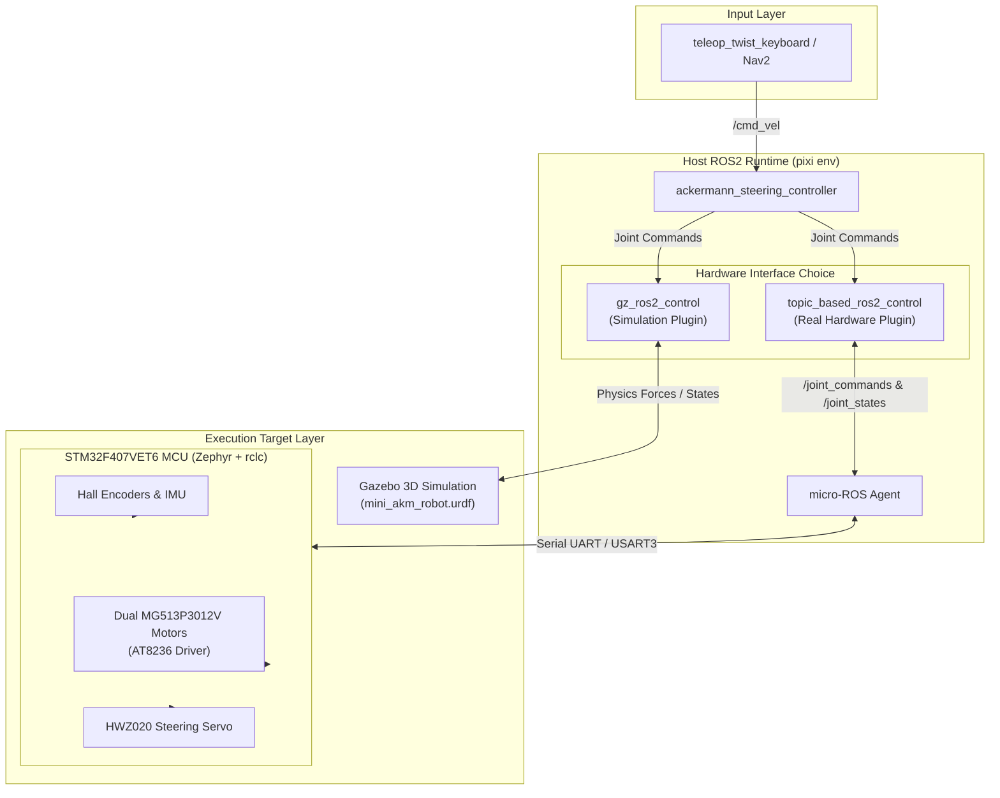
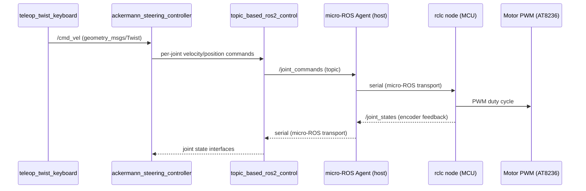
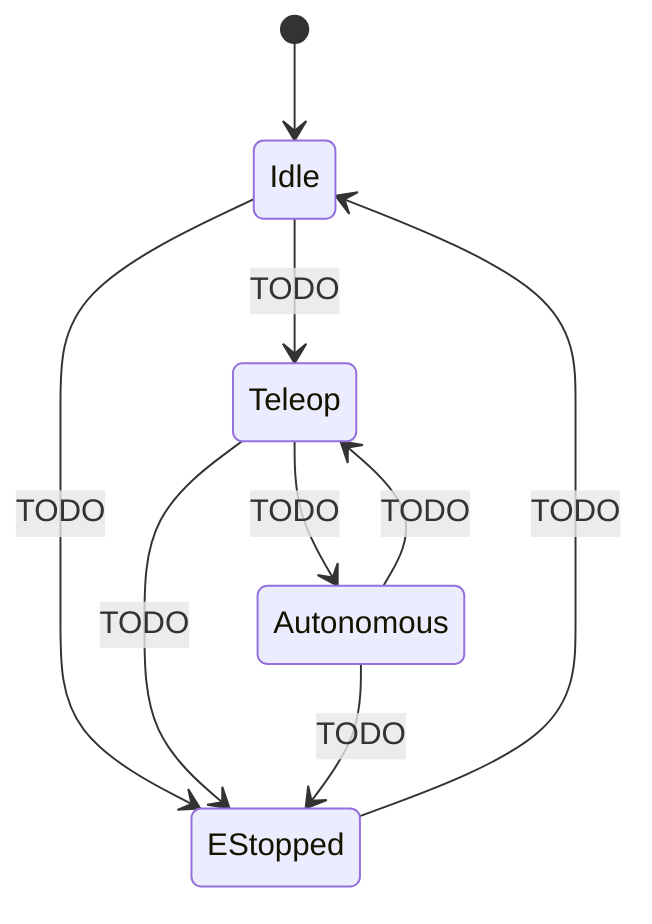

# System Architecture

This page describes the intended architecture for the robot: how the ROS2/Gazebo side (`mdp_ros`) and the STM32 firmware side (`mdp_stm32`) fit together.

!!! warning "Design doc, not a status report"
    This describes the **target** architecture. See [What's implemented vs. TODO](#whats-implemented-vs-todo) — most of this doesn't exist yet.

## The stack

**Host** (`mdp_ros`, `pixi`-managed, `robostack-jazzy` channel):

| Tool | Reason |
| --- | --- |
| ROS2 Jazzy (`ros-base`) | Node graph, topics, the whole pub/sub layer everything else plugs into |
| `xacro`, `robot_state_publisher`, `joint_state_publisher(-gui)` | Build and publish the robot's URDF/TF tree |
| `rviz2` | Visualize URDF/TF/sensor data while developing |
| `teleop_twist_keyboard` | Manual `/cmd_vel` input for testing before autonomy exists |
| `ros2_control`, `ros2_controllers`, `controller_manager` | Standard controller framework — includes `ackermann_steering_controller` for car-like steering |
| `gz_ros2_control`, `ros_gz` | Gazebo hardware_interface + host↔sim bridge |
| `colcon`, `compilers`, `cmake`, `ninja` | Standard ROS2 build toolchain |

**SBC Host** (`mdp_ros` on Raspberry Pi 4B 4GB):
Runs ROS2 Jazzy, vision pipeline (RPi Camera V2), micro-ROS Agent, and `ros2_control` (`ackermann_steering_controller`).

**Link** — micro-ROS over serial (Type-C USB-UART / `USART3` @ 115200 baud), connecting the micro-ROS Agent on RPi4B to the STM32 MCU. See [ADR 0001](adr/0001-microros-transport.md).

**MCU** (`mdp_stm32`):

| Tool | Reason |
| --- | --- |
| STM32F407VET6 (C30D V2.1 board) | Integrated controller board — AT8236 motor PWM driver for 2× MG513P3012V Hall encoder motors + HWZ020 steering servo. See [Hardware Components](hardware.md) |
| Zephyr RTOS | Firmware base — board bring-up done. See [ADR 0004](adr/0004-zephyr-firmware-base.md) |
| micro-ROS (rclc) | ROS2-on-MCU client library — publishes joint state & telemetry, subscribes to motor/steering commands. See [ADR 0001](adr/0001-microros-transport.md) |

**Repo-level tooling** (`mdp/`, outside the robot stack itself):

| Tool | Reason |
| --- | --- |
| `pixi` | One environment manager for docs + both submodules — no per-tool venv/conda juggling |
| Git submodules | `mdp_ros`/`mdp_stm32` are independently developed, versioned, and released — a submodule pins an exact commit rather than always tracking latest |
| OpenSpec | Spec-driven propose/apply/archive workflow — see [Dev Workflow & OpenSpec Setup](dev_workflow.md) |
| Zensical | This docs site generator |

## Why these choices

Full rationale in each ADR — summarized here:

| Choice | Instead of | ADR |
| --- | --- | --- |
| micro-ROS for host↔MCU transport | zenoh-pico / Pico-ROS | [0001](adr/0001-microros-transport.md) |
| `topic_based_ros2_control` hardware_interface | custom hardware_interface | [0002](adr/0002-topic-based-hw-interface.md) |
| Kinematics on host (`ackermann_steering_controller`) | kinematics on MCU | [0003](adr/0003-pattern-b-kinematics.md) |
| Zephyr as firmware base, only swap the transport | rewriting firmware from scratch | [0004](adr/0004-zephyr-firmware-base.md) |

## Diagram

### 1. Layered Architecture: Simulation Mode vs. Real Hardware Mode

```text
========================================================================================
                                     INPUT LAYER
                             [pixi run teleop] / [Nav2]
                                         │
                                         ▼ (/cmd_vel)
                               [ackermann_steering_controller] (ROS2 Host Controller)
========================================================================================
                                HARDWARE INTERFACE LAYER
                                         │
                       ┌─────────────────┴─────────────────┐
                       ▼ (Simulation Mode)                 ▼ (Real Hardware Mode)
                gz_ros2_control                       topic_based_ros2_control
                       │                                   │
                       │                                   │ /joint_commands & /joint_states
                       ▼                                   ▼
========================================================================================
                                   EXECUTION LAYER
              [Gazebo 3D World]                   [micro-ROS Agent] (Host)
           (Simulated Physics & Mesh)                      │
                                                           │ Serial UART (USB Type-C)
                                                           ▼
                                                  [STM32 MCU Firmware]
                                                  - Motor PWM (AT8236)
                                                  - Steering Servo (HWZ020)
                                                  - Encoders & IMU
========================================================================================
```

### 2. Host ↔ MCU Node Graph



## Message flow: teleop → motor

One end-to-end path across the host↔MCU boundary — where integration bugs (units, topic names, QoS) actually happen.



In Gazebo, same controller talks to `gz_ros2_control` instead of `topic_based_ros2_control`. See [ADR 0003](adr/0003-pattern-b-kinematics.md).

For the live node graph, run `rqt_graph` — don't hand-maintain a diagram that'll go stale.

## Robot operating modes

!!! warning "Placeholder — not designed yet"
    No mode-switching logic exists (see [status table](#whats-implemented-vs-todo)). TODO once mode switching / e-stop is actually implemented — not before.



## What's implemented vs. TODO

### `mdp_ros` (host) — build order, each step needs the one above it

1. [x] `mdp_description` + `mdp_bringup` — ported from `references/mdp_ws/`
2. [x] Gazebo simulation — needs step 1
3. [ ] `topic_based_ros2_control` + `ackermann_steering_controller` wiring on host — needs step 1

### `mdp_stm32` (MCU)

- [x] STM32F407VET6 board overlay / Zephyr bring-up — done (in old `mdp_mcu`)
- [x] Motor PWM driver (AT8236, 4 motors) — done (`motor.c`)
- [ ] micro-ROS integration on MCU — current firmware only runs a zenoh "hello" demo
- [ ] Steering servo driver — stub only
- [ ] Encoder reading — stub only
- [ ] IMU reading — stub only

## Reference

- Old firmware attempt (transport being replaced): `mdp_car_old/mdp_mcu/mdp_firmware`
- Old host-side control architecture notes: `mdp_car_old/mdp_ws/docs/control-architecture.md`
- Vendor stock firmware (reference only, not reused): `mdp_car_old/references/`
