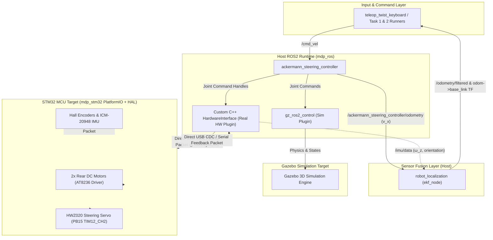
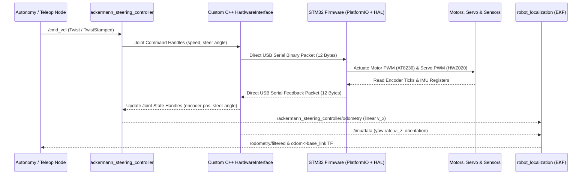

# System Architecture & Design Decisions

This guide documents the complete target architecture for the robot: host software stack (`mdp_ros`), MCU firmware stack (`mdp_stm32`), control & sensor fusion pipelines, development roadmap, and architectural decisions (ADRs).

!!! info "Target System Architecture"
    This document outlines the target architecture. For active development status, see [Development Status & Implementation Roadmap](#5-development-status-implementation-roadmap).

---

## 1. System Stack & Tooling

### Host Software (`mdp_ros` — ROS2 Jazzy on RPi4B / PC)

| Component / Tool | Category | Purpose & Role |
| --- | --- | --- |
| **ROS2 Jazzy (`ros-base`)** | Core Middleware | Distributed node graph, topic communication layer, and DDS. |
| **`robot_state_publisher` / `xacro`** | Robot Model | Builds and broadcasts the URDF / TF coordinate transform tree. |
| **`ackermann_steering_controller`** | Kinematics Engine | Converts `/cmd_vel` setpoints into individual wheel speeds and steering knuckle angles. |
| **Custom `HardwareInterface` (`C++`)** | Real HW Plugin | Direct USB Serial (`/dev/ttyACM0`) driver reading/writing binary packets to STM32. |
| **`gz_ros2_control` / `ros_gz`** | Sim HW Plugin | Integrates Gazebo Sim 3D physics engine with ROS2 control. |
| **`robot_localization` (`ekf_node`)** | Sensor Fusion | Fuses rear wheel odometry (linear velocity v_x) and ICM-20948 IMU into `/odometry/filtered`. |
| **`android_bridge_node` (`pyserial` / RFCOMM)** | Android Bridge | ROS2 Python node parsing Classic Bluetooth RFCOMM serial (`/dev/rfcomm0`) strings into ROS2 topics (`/cmd_vel`, `/odometry/filtered`). |
| **`rviz2` / Foxglove Bridge** | Visualization | Live 3D visualization of TF trees, sensor markers, camera feeds, and paths. |

### MCU Firmware (`mdp_stm32` — STM32F407VET6 on WHEELTEC C30D Board)

| Component | Category | Details & Responsibilities |
| --- | --- | --- |
| **PlatformIO + STM32 HAL** | Firmware Base | Lightweight C firmware with STM32Cube HAL drivers and ST-LINK uploading. |
| **USB CDC / UART Serial** | MCU Transport | Reads 12-byte binary command packets and replies with 12-byte encoder/sensor feedback. |
| **AT8236 Driver** | Motor PWM | Dual H-Bridge driving 2× rear `MG513P3012V` DC gear motors (TIM1/TIM9/TIM10/TIM11). |
| **HWZ020 Servo** | Steering PWM | 50 Hz PWM driver (`PB15` / TIM12_CH2) for front Ackermann steering knuckles. |
| **Hall Encoders** | Wheel Telemetry | Quadrature timer decoding (TIM2 / TIM3) for rear wheel travel displacement. |
| **ICM-20948 IMU** | Motion Telemetry | 9-DOF Gyro/Accel over I2C2 (`PB10`/`PB11`) providing yaw rotation feedback. |

---

## 2. System Data Flow & Architecture Diagram

### End-to-End Control & Telemetry Sequence

---

## 3. Sensor Fusion Pipeline (`robot_localization`)

To prevent position and heading drift during competition runs:

1. **Wheel Odometry (v_x):** `ackermann_steering_controller` calculates forward linear velocity from rear wheel encoders (`/ackermann_steering_controller/odometry`).
2. **IMU Heading (ω_z, θ):** The ICM-20948 IMU publishes angular velocity and rotation (`/imu/data`).
3. **EKF Fusion (`ekf_node`):** `robot_localization` fuses both streams to output smooth, drift-free `/odometry/filtered` and updates the dynamic `odom` → `base_link` TF transform.

---

## 4. Competition Requirements

??? info "Click to expand Task 1 & Task 2 Specifications"

    ### 🎯 Task 1: Automatic Exploration & Image Recognition (6-Min Limit)
    - **Arena:** 2.0m × 2.0m grid arena with 5 goal obstacles placed at supervisor-specified (x, y) coordinates.
    - **Preparation (2 Mins):** Android Tablet receives obstacle coordinates and target faces via Bluetooth and transmits setup to RPi4B.
    - **Autonomous Run:**
      - Starts in Carpark Zone.
      - Computes Hamiltonian Path / TSP Reeds-Shepp trajectory visiting all 5 targets (standoff distance: 20–50 cm).
      - Captures images via **RPi Camera Module V2**.
      - Runs YOLO26 image recognition to identify target symbol IDs.
      - Streams updates to Android Tablet (`TARGET, <Obstacle_ID>, <Target_ID>`).
      - Auto-stops within 6 minutes.

    ### ⚡ Task 2: Fastest Path Challenge (3-Min Limit)
    - **Goal:** Robot navigates automatically from Carpark Zone to Goal Obstacle.
    - **Symbol Recognition:** Identifies Left Arrow (←) or Right Arrow (→).
    - **Navigation:**
      - **Right Arrow:** Loops around the right side of the obstacle.
      - **Left Arrow:** Loops around the left side of the obstacle.
    - **Return & Stop:** Returns to Carpark Zone and auto-stops within 3 minutes.

---

## 5. Development Status & Implementation Roadmap

### `mdp_ros` (Host Software)

- [x] `mdp_description` + `mdp_bringup` — unified `mini_akm_robot.urdf.xacro` (sim/real gated by an `is_sim` arg), meshes, launch files, and controller YAMLs
- [x] Gazebo Simulation — `mini_akm_robot.urdf.xacro` (`is_sim:=true`) with `gz_ros2_control`
- [x] Real Hardware Integration — `mini_akm_robot.urdf.xacro` (`is_sim:=false`) with `topic_based_ros2_control`
- [x] Autonomy & Planning Nodes — Reeds-Shepp planner, Dubins pure pursuit follower, YOLO arrow detector, Task 1 & 2 state machines
- [x] `robot_localization` EKF Node (sim) — fuses `/ackermann_steering_controller/odometry` + simulated `/imu/data`, sole publisher of `odom→base_footprint` TF in sim (`enable_odom_tf: false` on the controller)
- [ ] `robot_localization` EKF Node (real) — `ekf_real.yaml` prepared but not launched; blocked on `mdp_stm32` encoder/IMU/micro-ROS integration below

### `mdp_stm32` (MCU Firmware)

- [x] Zephyr Workspace Setup — `pixi run setup` with ARM SDK and pyocd runner patch
- [x] STM32F407VET6 Board Bringup — LED blink (`PE8`) + RTT debug logging verified on physical board
- [x] AT8236 Motor PWM Driver — 1-indexed PWM channels verified working over RTT
- [!] micro-ROS Transport Integration — **In-Progress** (OpenSpec proposal `add-microros-transport`: host PyPI deps, `west.yml` manifest, and UART patch `scripts/patch_microros_uart.sh` complete; `rclc` executor thread pending)
- [ ] HWZ020 Steering Servo Driver (`PB15` / TIM12_CH2) — stub only
- [ ] Hall Encoder Driver (TIM2 / TIM3) — stub only
- [ ] ICM-20948 IMU Driver (I2C2 `PB10`/`PB11`) — stub only

---

## 6. Key Architectural Decisions (ADRs)

??? info "Click to expand Architectural Decision Records (ADRs 0001–0007) & Comparative Analysis Matrix"

    ### 📊 Comparative Analysis Matrix

    | Technology Area | Replaced / Alternative Choice | Chosen Solution | Key Architectural Advantage & Rationale |
    | --- | --- | --- | --- |
    | **1. Firmware Framework** | Zephyr RTOS / Heavy Middleware | **PlatformIO + STM32 HAL** | **Lightweight & High Performance.** Raw STM32 HAL C code compiled via PlatformIO provides fast, deterministic USB CDC interrupts (< 10 KB FLASH), avoiding RTOS overhead. |
    | **2. MCU Host Transport** | micro-ROS / XRCE-DDS | **Direct USB Serial (CDC/UART)** | **Deterministic & Sub-Millisecond.** Transmits 12-byte raw binary packets directly over USB serial without DDS middleware or daemon overhead. |
    | **3. Environment & Tooling** | Docker Containers / System `apt` / `uv` / Virtualenvs | **`pixi` (`robostack-jazzy`)** | **Multiplatform Environment Sync.** Pins native binary packages across Linux, macOS, and Windows (ROS2 Jazzy, Gazebo, PlatformIO, `ninja`) in a single `pixi.toml` lockfile without VM overhead. |
    | **4. Hardware Interface** | `topic_based_ros2_control` / micro-ROS | **Custom C++ `HardwareInterface`** | **Direct Memory-to-Wire Transfer.** Opens `/dev/ttyACM0` directly in C++, removing intermediate ROS topic bridges and process hops. |
    | **5. Middleware Framework** | ROS1 / Ad-hoc Custom Python Scripts | **ROS2 Jazzy** | **Full Robotics Stack Access.** Unlocks native Gazebo 3D simulation, standard `ackermann_steering_controller`, TF2 transform trees, and autonomous path planning pipelines out of the box. |
    | **6. Development Workflow** | Unstructured AI Prompts & Ad-hoc Commits | **Standard Git / Optional OpenSpec** | **Flexible & Simple.** Developers can use standard Git branches/commits directly, or optionally use OpenSpec (`propose`/`apply`/`archive`) when delegating structured specs to AI coding agents. |

    ---

    ### 📜 Decision Records

    ### 0001. PlatformIO + STM32 HAL Firmware Framework
    - **Decision:** Use **PlatformIO with STM32Cube HAL** as the firmware base for `mdp_stm32`.
    - **Why:** Full RTOS abstractions like Zephyr add unnecessary footprint and toolchain complexity for low-level motor drivers. PlatformIO with STM32 HAL provides native, lightweight C code with zero-overhead hardware timers (`TIM1`, `TIM9`, `TIM10`, `TIM11`, `TIM12`) and fast USB CDC serial interrupts.

    ### 0002. Direct USB Serial Protocol vs. micro-ROS Middleware
    - **Decision:** Use a **Direct 12-Byte Binary Packet Protocol** over USB CDC / UART (`/dev/ttyACM0` @ 115200 baud).
    - **Why:** micro-ROS introduces DDS middleware framing, `rclc` executor threads, and an external `micro_ros_agent` process on the RPi. Direct serial binary packets provide sub-millisecond execution, zero daemon management, and trivial debugging.

    ### 0003. Pixi Environment Manager vs. Docker / System `apt` / `uv`
    - **Decision:** Use **`pixi`** with the `robostack-jazzy` channel to manage the monorepo workspace.
    - **Why:** System `apt` packages lock developers to specific Linux OS versions, Docker containers introduce filesystem and GPU rendering overhead for Gazebo/RViz2, and Python-only managers (`uv`/`venv`) cannot manage native C++ robotics packages or cross-compilation SDKs. `pixi.toml` provides true multiplatform reproducibility across Linux, macOS, and Windows in a lightweight single-command workflow.

    ### 0004. Custom C++ `HardwareInterface` Driver
    - **Decision:** Write a **Custom C++ `hardware_interface::SystemInterface`** plugin (`mdp_hardware/MDPWheelHardware`) for `ros2_control`.
    - **Why:** `topic_based_ros2_control` introduces extra ROS topic hops and requires `micro_ros_agent`. A custom C++ `HardwareInterface` opens `/dev/ttyACM0` directly, executing binary I/O synchronously within `controller_manager` for maximum real-time determinism. Live tuning of Ackermann parameters (wheelbase, track width, speed limits) is preserved via ROS 2 YAML files.

    ### 0005. ROS2 Jazzy Middleware vs. Legacy ROS1 / Custom Scripts
    - **Decision:** Build the host software stack on **ROS2 Jazzy**.
    - **Why:** Ad-hoc Python scripts lack standardized TF coordinate transformations, sensor fusion nodes, and simulation bridges. ROS2 Jazzy gives us immediate access to Gazebo 3D simulation (`ros_gz`), standard Ackermann controllers, Nav2/path planning tools, and DDS middleware communication.

    ### 0006. Standard Development Workflow (Optional OpenSpec)
    - **Decision:** Use standard **Git workflow** as the primary process, with **OpenSpec** (`propose`, `apply`, `archive`) as an optional helper for AI-assisted task specification.
    - **Why:** Keeps the codebase accessible and easy for all team members to contribute using standard Git commands (`git commit`, `git push`), while allowing optional spec tracking when using AI agentic workflows.

    ### 0007. IMU-Fused Odometry via `robot_localization` EKF
    - **Decision:** Fuse `ackermann_steering_controller`'s wheel odometry with IMU yaw/yaw-rate through a `robot_localization` `ekf_node`, which becomes the sole publisher of `odom→base_footprint` TF (`enable_odom_tf: false` on the controller). Implemented and launched in simulation now; a matching `ekf_real.yaml` is prepared but not launched on real hardware yet.
    - **Why:** `ackermann_steering_controller`'s odometry is a two-parameter bicycle-model estimate (`wheelbase`, `steering_track_width`) with no term for the front wheels' kingpin-to-wheel-center offset (see `docs/hardware.md` drivetrain table and `docs/troubleshooting.md`). Under real friction this makes wheel-only heading drift from the true turn rate — worst during sharp turns, which is exactly what Task 2's slalom needs most. This is a real limitation, not a sim artifact: it will affect real hardware identically once encoders exist there. Fusing an IMU corrects it with the same node graph and config shape on both platforms, rather than a per-platform hack. Real-hardware activation is blocked on `mdp_stm32` firmware (encoder, IMU, and micro-ROS integration are still stubs — see Section 5 above); `ekf_real.yaml` exists so wiring it into `real.launch.py` is a drop-in once that firmware lands.

---

## 7. References & Historical Documents

- **Firmware Reference:** `references/mdp_mcu/mdp_firmware`
- **Host Control Reference:** `references/mdp_ws/docs/control-architecture.md`
- **Vendor Reference:** `references/WHEELTEC/`
