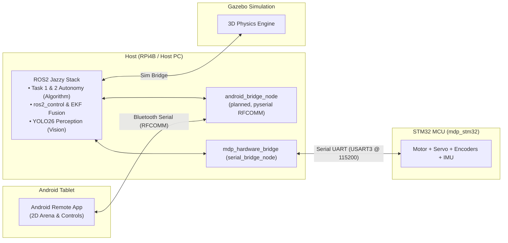
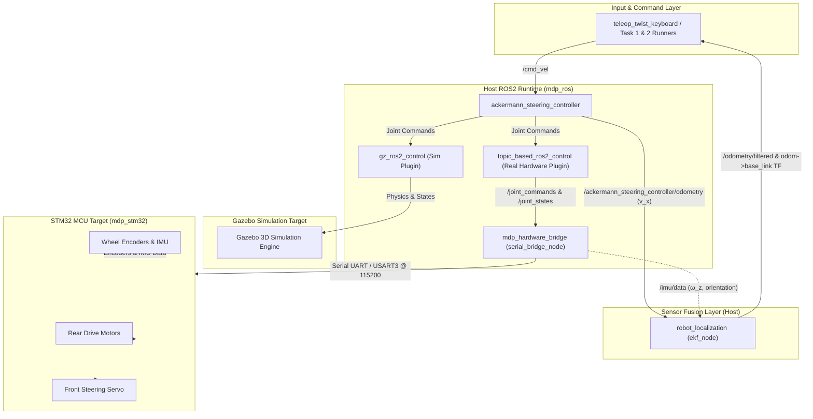
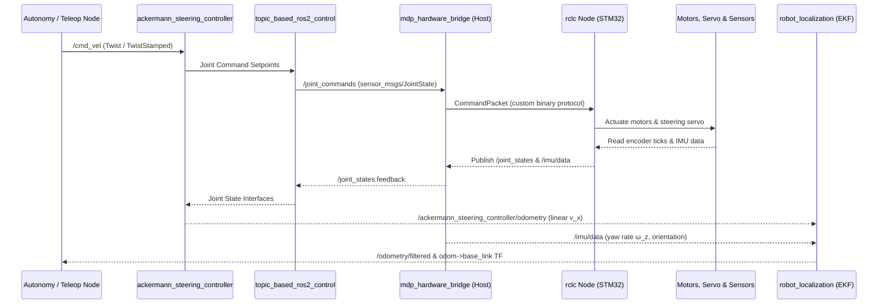

# System Architecture & Design Decisions

This guide documents the **target architecture** for the robot: system stack & tooling, the
end-to-end data flow between the RPi host and the STM32 MCU, and the architectural decisions (ADRs)
behind why the stack looks the way it does. It does **not** cover implementation status, per-subteam
detail, or competition requirements — see the links at the end of each section for where that content
actually lives now.

---

## 1. System Stack — who talks to whom

This is deliberately high-level: what each subsystem's *role* is and what it *communicates with*, not
how any one of them is internally implemented (chip selection, pin assignment, PID gains, etc. all
live in each subteam's own docs, linked below).

| Subsystem | Role | Talks to |
| --- | --- | --- |
| **Android app** | Operator UI — sends drive commands, receives status | RPi, over Bluetooth RFCOMM (see [Android](android/index.md)) |
| **RPi host (`mdp_ros`)** | Runs ROS2, owns all kinematics + sensor fusion, bridges every other subsystem together | Android (RFCOMM), STM32 (USART3 binary protocol), Vision + Algorithm nodes (ROS topics) — see [RPi](rpi/index.md) |
| **Vision (`mdp_ros/vision`)** | Camera-based target/arrow recognition | Publishes detections to the RPi's ROS graph — see [Vision](vision/index.md) |
| **Algorithm (`mdp_control`, `wayp_plan_tools`)** | Path planning (Reeds-Shepp/Dubins) and Task 1 & 2 state machines | Consumes Vision output + robot pose, publishes `/cmd_vel` into the RPi's ROS graph — see [Algorithm](algorithm/index.md) |
| **STM32 MCU (`mdp_stm32`)** | Pure hardware I/O controller — drives motors/servo, reads encoders/IMU | RPi only, over a custom binary protocol on `USART3` @ 115200 baud — see [STM32](stm32/index.md) |

**Sim vs. real hardware**: the same RPi-side kinematics (`ackermann_steering_controller`) drives
either a Gazebo simulation or the real STM32 over the same command/state interface, swapped via
`ros2_control`'s hardware plugin — see the data flow diagram below for exactly where that split
happens.

### At a glance

---

## 2. System Data Flow & Architecture Diagram

### End-to-End Control & Telemetry Sequence

For the sensor fusion pipeline's own details (why EKF, what it fuses), see
[RPi: Sensor Fusion Pipeline](rpi/sensor_fusion.md). For competition task requirements, see
[Assessment & Checklist](assessment_checklist.md). For per-subteam implementation status, see each
subteam's own page (linked throughout section 1 above).

---

## 3. Key Architectural Decisions (ADRs)

??? info "Click to expand Architectural Decision Records (ADRs 0001–0006) & Comparative Analysis Matrix"

    ### 📊 Comparative Analysis Matrix

    | Technology Area | Replaced / Alternative Choice | Chosen Solution | Key Architectural Advantage & Rationale |
    | --- | --- | --- | --- |
    | **1. Firmware RTOS Base** | Zephyr RTOS | **Bare-Metal STM32Cube HAL (via PlatformIO)** | **Faster Bring-Up & Vendor Reference Compatibility.** WHEELTEC's own stock C30D firmware (used to verify pin/timer assignments and port the motor/encoder/servo drivers) is STM32 HAL-based, not Zephyr — porting it directly and iterating via PlatformIO's build/flash/monitor tasks was far faster for the course timeline than authoring Zephyr Devicetree overlays and West manifests from scratch. Superseded [ADR 0001](#0001-stm32cube-hal-bare-metal-via-platformio-vs-zephyr-rtos) below. |
    | **2. MCU Host Transport** | micro-ROS (`rclc`) | **Custom Binary Protocol + `mdp_hardware_bridge` (`rclcpp`)** | **Avoids RTOS-Coupled Client Library on Bare-Metal HAL.** `rclc`/micro-ROS targets Zephyr/FreeRTOS environments; a hand-rolled framed protocol (sync bytes + struct + XOR checksum) is a few hundred lines on each side and still surfaces completely standard ROS2 topics to the rest of the stack via a plain `rclcpp` bridge node. Superseded [ADR 0002](#0002-custom-binary-serial-protocol-vs-micro-ros-rclc) below. |
    | **3. Environment & Tooling** | Docker Containers / System `apt` / `uv` / Virtualenvs | **`pixi` (`robostack-jazzy`)** | **Multiplatform Environment Sync.** Pins native binary packages across Linux, macOS, and Windows (ROS2 Jazzy, Gazebo, PlatformIO) in a single `pixi.toml` lockfile without VM overhead. |
    | **4. Hardware Interface** | Custom C++ `hardware_interface` Driver | **`topic_based_ros2_control`** | **Avoid Custom Hardware Code.** Bridges `ros2_control` directly to ROS topics, avoiding complex custom C++ hardware drivers and unlocking ROS2's standard robotics stack in both Sim and Real HW. |
    | **5. Middleware Framework** | ROS1 / Ad-hoc Custom Python Scripts | **ROS2 Jazzy** | **Full Robotics Stack Access.** Unlocks native Gazebo 3D simulation, standard `ackermann_steering_controller`, TF2 transform trees, and autonomous path planning pipelines out of the box. |
    | **6. Development Workflow** | Unstructured AI Prompts & Ad-hoc Commits | **OpenSpec (`propose`/`apply`/`archive`)** | **Token-Efficient LLM Orchestration.** Optimized for modern Agentic AI / LLM workflows (Antigravity subagents). Keeps token usage lightweight, context clean, and change scope strictly bounded. |

    ---

    ### 📜 Decision Records

    ### 0001. STM32Cube HAL (Bare-Metal, via PlatformIO) vs. Zephyr RTOS
    - **Decision:** Use bare-metal **STM32Cube HAL**, built and flashed via **PlatformIO** (`pixi run build`/`flash`/`probe`/`monitor`), as the firmware base for `mdp_stm32`. Supersedes the original decision to use Zephyr RTOS.
    - **Why:** Zephyr's multi-MCU portability (Devicetree overlays, unified driver APIs) wasn't worth its setup cost for a single fixed target board (WHEELTEC C30D, STM32F407VET6) on a one-semester course timeline. WHEELTEC's own vendor reference firmware for the C30D — used to verify every pin/timer assignment and port the motor PWM, encoder, and steering servo drivers — is itself STM32 HAL-based, so bare-metal HAL let that reference code be ported near-directly instead of rewritten against Zephyr's driver model and Devicetree bindings from scratch.

    ### 0002. Custom Binary Serial Protocol vs. micro-ROS (`rclc`)
    - **Decision:** Use a **custom lightweight framed binary protocol** (sync bytes + fixed-size struct + XOR checksum) over `USART3` (USB Type-C @ 115200 baud), bridged into ROS2 by a plain `rclcpp` node (`mdp_hardware_bridge`). Supersedes the original decision to use micro-ROS (`rclc`).
    - **Why:** micro-ROS's `rclc` client library and executor primarily target RTOS environments (Zephyr, FreeRTOS) with build-system integration for message type generation; porting it onto this bare-metal STM32Cube HAL/PlatformIO firmware (see [ADR 0001](#0001-stm32cube-hal-bare-metal-via-platformio-vs-zephyr-rtos)) would have been a substantial side effort on its own. A hand-rolled protocol is a few hundred lines on each side (see [Serial Protocol](stm32/protocol.md)), ships the exact fields this robot actually needs (encoder ticks, IMU, e-stop, wheel/steering setpoints), and the host-side `mdp_hardware_bridge` node still speaks completely standard ROS2 topics (`/joint_commands`, `/joint_states`, `/imu/data`) to the rest of the stack — `topic_based_ros2_control` and `robot_localization` don't know or care that micro-ROS isn't involved.

    ### 0003. Pixi Environment Manager vs. Docker / System `apt` / `uv`
    - **Decision:** Use **`pixi`** with the `robostack-jazzy` channel to manage the monorepo workspace.
    - **Why:** System `apt` packages lock developers to specific Linux OS versions, Docker containers introduce filesystem and GPU rendering overhead for Gazebo/RViz2, and Python-only managers (`uv`/`venv`) cannot manage native C++ robotics packages or ARM cross-compilation SDKs. `pixi.toml` provides true multiplatform reproducibility across Linux, macOS, and Windows in a lightweight single-command workflow.

    ### 0004. Hardware Interface (`topic_based_ros2_control`) & Host-Side Kinematics
    - **Decision:** Use **`topic_based_ros2_control`** as the real-hardware plugin for `ros2_control` and run all Ackermann kinematics on the ROS2 host.
    - **Why:** Writing custom C++ `hardware_interface` drivers requires extensive low-level C++ hardware code. `topic_based_ros2_control` bridges command and state interfaces directly to standard ROS topics (`/joint_commands` and `/joint_states`), allowing the exact same `ackermann_steering_controller` node to run seamlessly in both Gazebo Sim and Real Hardware. Furthermore, keeping kinematics on the ROS2 host allows developers to **tune parameters live (wheelbase, track width, steering limits, speed/accel limits) via ROS2 YAML files or `ros2 param set` while the robot is running—without ever having to recompile or reflash the STM32 MCU firmware over ST-LINK.**

    ### 0005. ROS2 Jazzy Middleware vs. Legacy ROS1 / Custom Scripts
    - **Decision:** Build the host software stack on **ROS2 Jazzy**.
    - **Why:** Ad-hoc Python scripts lack standardized TF coordinate transformations, sensor fusion nodes, and simulation bridges. ROS2 Jazzy gives us immediate access to Gazebo 3D simulation (`ros_gz`), standard Ackermann controllers, Nav2/path planning tools, and DDS middleware communication.

    ### 0006. OpenSpec Spec-Driven Workflow vs. Unstructured AI Prompts
    - **Decision:** Use **OpenSpec** (`propose`, `apply`, `archive`) for AI-assisted development across submodules.
    - **Why:** In modern development with LLM coding agents (Antigravity, Superhuman, Claude Code), orchestrating multiple subagents requires light token usage, clear context boundaries, and structured task execution. OpenSpec provides a lightweight, token-efficient framework that maintains system specs in `openspec/specs/` as the single source of truth, enforcing strict task checklists and preventing scope creep.
