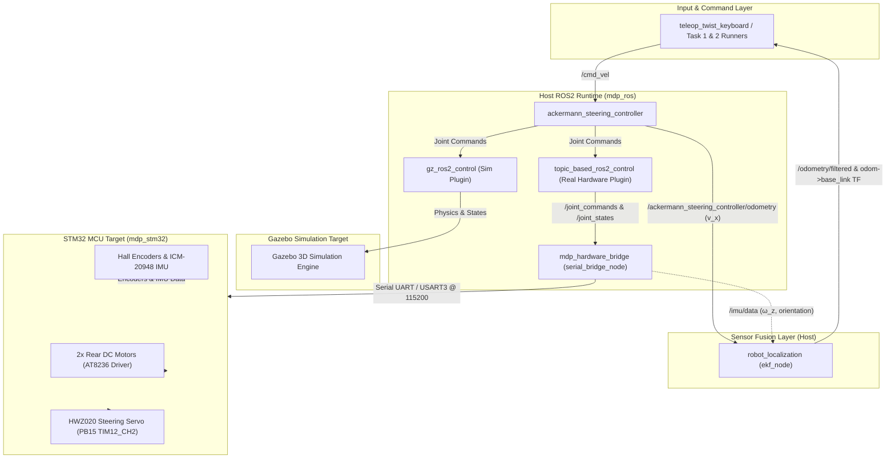
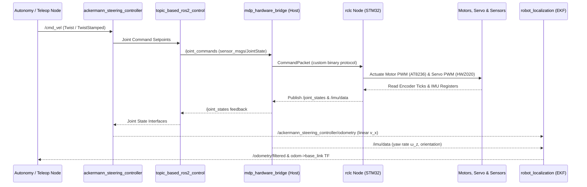

# System Architecture & Design Decisions

This guide documents the complete target architecture for the robot: host software stack (`mdp_ros`), MCU firmware stack (`mdp_stm32`), control & sensor fusion pipelines, development roadmap, and architectural decisions (ADRs).

!!! info "Target System Architecture"
    This document outlines the target architecture. For active development status, see [Development Status & Implementation Roadmap](#5-development-status-implementation-roadmap).

---

## 1. System Stack & Tooling

### Host Software (`mdp_ros` — ROS2 Jazzy on RPi4B / PC)

| Component / Tool | Category | Purpose & Role |
| --- | --- | --- |
| **ROS2 Jazzy (`ros-base`)** | Core Middleware | Distributed node graph, topic communication layer, and DDS. |
| **`robot_state_publisher` / `xacro`** | Robot Model | Builds and broadcasts the URDF / TF coordinate transform tree. |
| **`ackermann_steering_controller`** | Kinematics Engine | Converts `/cmd_vel` setpoints into individual wheel speeds and steering knuckle angles. |
| **`topic_based_ros2_control`** | Real HW Plugin | Maps `ros2_control` commands & states to ROS topics (`/joint_commands`, `/joint_states`). |
| **`gz_ros2_control` / `ros_gz`** | Sim HW Plugin | Integrates Gazebo Sim 3D physics engine with ROS2 control. |
| **`robot_localization` (`ekf_node`)** | Sensor Fusion | Fuses rear wheel odometry (linear velocity v_x) and ICM-20948 IMU (yaw rate ω_z, heading θ) into `/odometry/filtered`. |
| **`android_bridge_node` (`pyserial` / RFCOMM)** | Android Bridge | ROS2 Python node parsing Classic Bluetooth RFCOMM serial (`/dev/rfcomm0`) strings into ROS2 topics (`/cmd_vel`, `/odometry/filtered`). |
| **`mdp_hardware_bridge` (`serial_bridge_node`)** | Host↔MCU Bridge | `rclcpp` node bridging `/joint_commands`, `/joint_states`, `/imu/data`, `/estop` to the STM32 MCU over the custom binary protocol on `USART3` — see [Serial Protocol](stm32/protocol.md). |
| **`rviz2` / Foxglove Bridge** | Visualization | Live 3D visualization of TF trees, sensor markers, camera feeds, and paths. |

### MCU Firmware (`mdp_stm32` — STM32F407VET6 on WHEELTEC C30D Board)

| Component | Category | Details & Responsibilities |
| --- | --- | --- |
| **STM32Cube HAL (bare-metal, via PlatformIO)** | Firmware Base | Vendor HAL peripheral drivers (GPIO, TIM, I2C, UART), built/flashed via PlatformIO (`pixi run build`/`flash`/`probe`). |
| **Custom Binary Protocol** | MCU Client | Firmware sends telemetry (encoder/IMU/e-stop), receives wheel/steering commands — see [Serial Protocol](stm32/protocol.md). |
| **AT8236 Driver** | Motor PWM | Dual H-Bridge driving 2× rear `MG513P3012V` DC gear motors (Motor A & B). |
| **HWZ020 Servo** | Steering PWM | 50 Hz PWM driver (`PB15` / TIM12_CH2) for front Ackermann steering knuckles. |
| **Hall Encoders** | Wheel Telemetry | Quadrature timer decoding (TIM2 / TIM3) for rear wheel travel displacement. |
| **ICM-20948 IMU** | Motion Telemetry | 9-DOF Gyro/Accel over I2C2 (`PB10`/`PB11`) providing yaw rotation feedback. |

---

## 2. System Data Flow & Architecture Diagram

### End-to-End Control & Telemetry Sequence

---

## 3. Sensor Fusion Pipeline (`robot_localization`)

To prevent position and heading drift during competition runs:

1. **Wheel Odometry (v_x):** `ackermann_steering_controller` calculates forward linear velocity from rear wheel encoders (`/ackermann_steering_controller/odometry`).
2. **IMU Heading (ω_z, θ):** The ICM-20948 IMU publishes angular velocity and rotation (`/imu/data`).
3. **EKF Fusion (`ekf_node`):** `robot_localization` fuses both streams to output smooth, drift-free `/odometry/filtered` and updates the dynamic `odom` → `base_link` TF transform.

---

## 4. Competition Requirements

??? info "Click to expand Task 1 & Task 2 Specifications"

    ### 🎯 Task 1: Automatic Exploration & Image Recognition (6-Min Limit)
    - **Arena:** 2.0m × 2.0m grid arena with 5 goal obstacles placed at supervisor-specified (x, y) coordinates.
    - **Preparation (2 Mins):** Android Tablet receives obstacle coordinates and target faces via Bluetooth and transmits setup to RPi4B.
    - **Autonomous Run:**
      - Starts in Carpark Zone.
      - Computes Hamiltonian Path / TSP Reeds-Shepp trajectory visiting all 5 targets (standoff distance: 20–50 cm).
      - Captures images via **RPi Camera Module V2**.
      - Runs YOLO26 image recognition to identify target symbol IDs.
      - Streams updates to Android Tablet (`TARGET, <Obstacle_ID>, <Target_ID>`).
      - Auto-stops within 6 minutes.

    ### ⚡ Task 2: Fastest Path Challenge (3-Min Limit)
    - **Goal:** Robot navigates automatically from Carpark Zone to Goal Obstacle.
    - **Symbol Recognition:** Identifies Left Arrow (←) or Right Arrow (→).
    - **Navigation:**
      - **Right Arrow:** Loops around the right side of the obstacle.
      - **Left Arrow:** Loops around the left side of the obstacle.
    - **Return & Stop:** Returns to Carpark Zone and auto-stops within 3 minutes.

---

## 5. Development Status & Implementation Roadmap

### `mdp_ros` (Host Software)

- [x] `mdp_description` + `mdp_bringup` — URDF models, meshes, launch files, and controller YAMLs
- [x] Gazebo Simulation — `mini_akm_robot.urdf` with `gz_ros2_control`
- [x] Real Hardware Integration — `mini_akm_real_robot.urdf` with `topic_based_ros2_control`
- [x] Autonomy & Planning Nodes — Reeds-Shepp planner, Dubins pure pursuit follower, YOLO arrow detector, Task 1 & 2 state machines
- [x] `robot_localization` EKF Node — `ekf.yaml` + `real.launch.py` wiring fusing `/ackermann_steering_controller/odometry` (v_x) + `/imu/data` (yaw, ω_z) into `/odometry/filtered`; not yet driven on physical hardware, only config-validated (see [Launch Files](ros/launch.md#sensor-fusion-architecture-robot_localization))

### `mdp_stm32` (MCU Firmware)

- [x] PlatformIO/STM32Cube HAL Project Bringup — LED blink (`PE8`) + `printf` serial logging over `USART3`, verified on physical board
- [x] AT8236 Motor PWM Driver — `TIM9`/`TIM10`/`TIM11` PWM implemented (`motor_init`, `motor_set_speed`); **on-hardware drive test confirmed** (locked-antiphase drive scheme required, see [Drivers](stm32/drivers.md#at8236-motor-driver-motorc))
- [x] HWZ020 Steering Servo Driver (`PB15` / TIM12_CH2) — Implemented (`servo_init`, `servo_set_angle`); on-hardware steering confirmed via ROS2 teleop; mechanical steering-lock angle not yet tuned
- [x] Hall Encoder Driver (TIM2 / TIM3) — Implemented (`encoder_init`, delta + cumulative tick reads)
- [x] ICM-20948 IMU Driver (I2C2 `PB10`/`PB11`) — Implemented
- [x] Onboard Enable/E-Stop Switch (`PD3`) — Implemented (`motor_estop_engaged`); active-low polarity functionally confirmed via self-test refusal behavior, not yet confirmed with a multimeter
- [x] Serial Protocol + `mdp_hardware_bridge` — Custom binary protocol over `USART3` implemented on both sides (see [Serial Protocol](stm32/protocol.md)); replaces the originally planned micro-ROS transport ([ADR 0002](#0002-custom-binary-serial-protocol-vs-micro-ros-rclc)); **full round-trip on-hardware validated** via `pixi run hardware` + `pixi run teleop` (two bugs found and fixed along the way — see [Launch Files](ros/launch.md#core-topic-specifications))
- [x] Battery Voltage ADC (`PB0` / ADC1_CH8) — Implemented (`battery_init`, `battery_read_voltage`); divider ratio (11x) sourced from WHEELTEC's C30D vendor example firmware, not yet cross-checked against a multimeter on this specific board
- [ ] Ultrasonic Distance Sensor (HC-SR04) Driver — Not started
- [ ] IR Distance Sensor (Sharp GP2Y0A21YK ×2) Driver — Not started

---

## 6. Key Architectural Decisions (ADRs)

??? info "Click to expand Architectural Decision Records (ADRs 0001–0006) & Comparative Analysis Matrix"

    ### 📊 Comparative Analysis Matrix

    | Technology Area | Replaced / Alternative Choice | Chosen Solution | Key Architectural Advantage & Rationale |
    | --- | --- | --- | --- |
    | **1. Firmware RTOS Base** | Zephyr RTOS | **Bare-Metal STM32Cube HAL (via PlatformIO)** | **Faster Bring-Up & Vendor Reference Compatibility.** WHEELTEC's own stock C30D firmware (used to verify pin/timer assignments and port the motor/encoder/servo drivers) is STM32 HAL-based, not Zephyr — porting it directly and iterating via PlatformIO's build/flash/monitor tasks was far faster for the course timeline than authoring Zephyr Devicetree overlays and West manifests from scratch. Superseded [ADR 0001](#0001-stm32cube-hal-bare-metal-via-platformio-vs-zephyr-rtos) below. |
    | **2. MCU Host Transport** | micro-ROS (`rclc`) | **Custom Binary Protocol + `mdp_hardware_bridge` (`rclcpp`)** | **Avoids RTOS-Coupled Client Library on Bare-Metal HAL.** `rclc`/micro-ROS targets Zephyr/FreeRTOS environments; a hand-rolled framed protocol (sync bytes + struct + XOR checksum) is a few hundred lines on each side and still surfaces completely standard ROS2 topics to the rest of the stack via a plain `rclcpp` bridge node. Superseded [ADR 0002](#0002-custom-binary-serial-protocol-vs-micro-ros-rclc) below. |
    | **3. Environment & Tooling** | Docker Containers / System `apt` / `uv` / Virtualenvs | **`pixi` (`robostack-jazzy`)** | **Multiplatform Environment Sync.** Pins native binary packages across Linux, macOS, and Windows (ROS2 Jazzy, Gazebo, PlatformIO) in a single `pixi.toml` lockfile without VM overhead. |
    | **4. Hardware Interface** | Custom C++ `hardware_interface` Driver | **`topic_based_ros2_control`** | **Avoid Custom Hardware Code.** Bridges `ros2_control` directly to ROS topics, avoiding complex custom C++ hardware drivers and unlocking ROS2's standard robotics stack in both Sim and Real HW. |
    | **5. Middleware Framework** | ROS1 / Ad-hoc Custom Python Scripts | **ROS2 Jazzy** | **Full Robotics Stack Access.** Unlocks native Gazebo 3D simulation, standard `ackermann_steering_controller`, TF2 transform trees, and autonomous path planning pipelines out of the box. |
    | **6. Development Workflow** | Unstructured AI Prompts & Ad-hoc Commits | **OpenSpec (`propose`/`apply`/`archive`)** | **Token-Efficient LLM Orchestration.** Optimized for modern Agentic AI / LLM workflows (Antigravity subagents). Keeps token usage lightweight, context clean, and change scope strictly bounded. |

    ---

    ### 📜 Decision Records

    ### 0001. STM32Cube HAL (Bare-Metal, via PlatformIO) vs. Zephyr RTOS
    - **Decision:** Use bare-metal **STM32Cube HAL**, built and flashed via **PlatformIO** (`pixi run build`/`flash`/`probe`/`monitor`), as the firmware base for `mdp_stm32`. Supersedes the original decision to use Zephyr RTOS.
    - **Why:** Zephyr's multi-MCU portability (Devicetree overlays, unified driver APIs) wasn't worth its setup cost for a single fixed target board (WHEELTEC C30D, STM32F407VET6) on a one-semester course timeline. WHEELTEC's own vendor reference firmware for the C30D — used to verify every pin/timer assignment and port the motor PWM, encoder, and steering servo drivers — is itself STM32 HAL-based, so bare-metal HAL let that reference code be ported near-directly instead of rewritten against Zephyr's driver model and Devicetree bindings from scratch.

    ### 0002. Custom Binary Serial Protocol vs. micro-ROS (`rclc`)
    - **Decision:** Use a **custom lightweight framed binary protocol** (sync bytes + fixed-size struct + XOR checksum) over `USART3` (USB Type-C @ 115200 baud), bridged into ROS2 by a plain `rclcpp` node (`mdp_hardware_bridge`). Supersedes the original decision to use micro-ROS (`rclc`).
    - **Why:** micro-ROS's `rclc` client library and executor primarily target RTOS environments (Zephyr, FreeRTOS) with build-system integration for message type generation; porting it onto this bare-metal STM32Cube HAL/PlatformIO firmware (see [ADR 0001](#0001-stm32cube-hal-bare-metal-via-platformio-vs-zephyr-rtos)) would have been a substantial side effort on its own. A hand-rolled protocol is a few hundred lines on each side (see [Serial Protocol](stm32/protocol.md)), ships the exact fields this robot actually needs (encoder ticks, IMU, e-stop, wheel/steering setpoints), and the host-side `mdp_hardware_bridge` node still speaks completely standard ROS2 topics (`/joint_commands`, `/joint_states`, `/imu/data`) to the rest of the stack — `topic_based_ros2_control` and `robot_localization` don't know or care that micro-ROS isn't involved.

    ### 0003. Pixi Environment Manager vs. Docker / System `apt` / `uv`
    - **Decision:** Use **`pixi`** with the `robostack-jazzy` channel to manage the monorepo workspace.
    - **Why:** System `apt` packages lock developers to specific Linux OS versions, Docker containers introduce filesystem and GPU rendering overhead for Gazebo/RViz2, and Python-only managers (`uv`/`venv`) cannot manage native C++ robotics packages or ARM cross-compilation SDKs. `pixi.toml` provides true multiplatform reproducibility across Linux, macOS, and Windows in a lightweight single-command workflow.

    ### 0004. Hardware Interface (`topic_based_ros2_control`) & Host-Side Kinematics
    - **Decision:** Use **`topic_based_ros2_control`** as the real-hardware plugin for `ros2_control` and run all Ackermann kinematics on the ROS2 host.
    - **Why:** Writing custom C++ `hardware_interface` drivers requires extensive low-level C++ hardware code. `topic_based_ros2_control` bridges command and state interfaces directly to standard ROS topics (`/joint_commands` and `/joint_states`), allowing the exact same `ackermann_steering_controller` node to run seamlessly in both Gazebo Sim and Real Hardware. Furthermore, keeping kinematics on the ROS2 host allows developers to **tune parameters live (wheelbase, track width, steering limits, speed/accel limits) via ROS2 YAML files or `ros2 param set` while the robot is running—without ever having to recompile or reflash the STM32 MCU firmware over ST-LINK.**

    ### 0005. ROS2 Jazzy Middleware vs. Legacy ROS1 / Custom Scripts
    - **Decision:** Build the host software stack on **ROS2 Jazzy**.
    - **Why:** Ad-hoc Python scripts lack standardized TF coordinate transformations, sensor fusion nodes, and simulation bridges. ROS2 Jazzy gives us immediate access to Gazebo 3D simulation (`ros_gz`), standard Ackermann controllers, Nav2/path planning tools, and DDS middleware communication.

    ### 0006. OpenSpec Spec-Driven Workflow vs. Unstructured AI Prompts
    - **Decision:** Use **OpenSpec** (`propose`, `apply`, `archive`) for AI-assisted development across submodules.
    - **Why:** In modern development with LLM coding agents (Antigravity, Superhuman, Claude Code), orchestrating multiple subagents requires light token usage, clear context boundaries, and structured task execution. OpenSpec provides a lightweight, token-efficient framework that maintains system specs in `openspec/specs/` as the single source of truth, enforcing strict task checklists and preventing scope creep.

---

## 7. References & Historical Documents

- **Firmware Reference:** `references/WHEELTEC/2.WHEELTEC R550-V550 ROS教育机器人运动底盘资料/` (C30D pinout/schematic PDFs + Hall-encoder STM32 source zip, see [References](references.md#local-references-directory-guide))
- **Host Control Reference:** `references/mdp_ws/docs/control-architecture.md`
- **Vendor Reference:** `references/WHEELTEC/`
