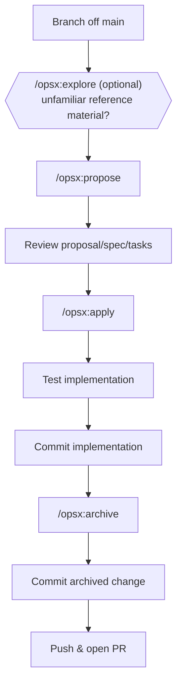

# Dev Workflow & OpenSpec Setup

This guide covers setting up your development environment with OpenSpec and executing day-to-day work across submodules (`mdp_ros` and `mdp_stm32`).

---

## 1. Initial OpenSpec Setup

`openspec/` folders inside submodules are already committed — never create them manually. Only `.claude/` or tool-specific folders (gitignored) need to be generated per machine.

### Step 1: Install CLI (Once per machine)

```bash
pixi global install nodejs
npm install -g @fission-ai/openspec@latest
```

### Step 2: Set up AI tool (Once per submodule, per machine)

```bash
cd mdp_ros        # or mdp_stm32
openspec init
```

Select your AI tool (e.g., Claude Code, Cursor, Antigravity) and restart your IDE. 
- Run `openspec update` after upgrading the CLI to refresh tool settings.

### Step 3: Workspace Root Requirement
To use `/opsx:*` slash commands, open the specific submodule directory as your workspace root (e.g., `code mdp_ros`), not the top-level `mdp/` monorepo directory.

---

## 2. OpenSpec Concepts & Structure

```text
openspec/
├── config.yaml                        Project-wide config (schema, context, rules)
├── specs/                             Merged current system specification (updated by archive)
│   └── <capability>/
│       └── spec.md
└── changes/
    ├── <change-name>/                 In-flight proposal
    │   ├── proposal.md                Why / What Changes / Capabilities / Impact
    │   ├── design.md                  Architecture context / Decisions (optional)
    │   ├── tasks.md                   Implementation checklist (used by apply)
    │   └── specs/<capability>/spec.md Delta spec (ADDED/MODIFIED/REMOVED requirements)
    └── archive/                       Completed & archived proposals
```

- **`openspec/specs/`**: System source of truth. Populated automatically when a change is archived.
- **`openspec/changes/<name>/`**: Contains in-flight requirements and checklists.

### Auto-Context (`config.yaml`)
To automatically include system architecture in proposals, ensure `openspec/config.yaml` includes:

```yaml
context: |
  Read ../docs/architecture.md before proposing anything.
```

---

## 3. Day-to-Day Development Loop



!!! note "OpenSpec Git Independence"
    OpenSpec commands (`propose`, `apply`, `archive`) only create/edit files. Branching, committing, and pushing are standard git operations.

---

## 4. OpenSpec Commands Reference

=== "Slash Commands (Recommended)"

    | Stage | Command | Description |
    |---|---|---|
    | Explore | `/opsx:explore` | Interactive discussion to clarify requirements |
    | Propose | `/opsx:propose "<description>"` | Generates `proposal.md`, spec deltas, `design.md`, and `tasks.md` |
    | Apply | `/opsx:apply` | Implements the task checklist |
    | Archive | `/opsx:archive` | Moves change to `archive/` and updates system specs |

=== "CLI Commands"

    | Stage | Command | Description |
    |---|---|---|
    | Propose | `openspec new change <name>` | Scaffolds change files to fill in manually |
    | Validate | `openspec change validate <name>` | Validates change formatting |
    | Archive | `openspec archive <name>` | Moves change to `archive/` and updates system specs |

---

## 5. Branch Naming & Commit Guidelines

### Branch Format
```text
<your-name>/<change-name>
```
*Example*: `alvin/add-mdp-description`, `jess/fix-steering-servo-pwm`

| Prefix | Meaning |
|---|---|
| `add-...` | New feature or capability |
| `fix-...` | Bug fix |
| `refactor-...` | Code refactoring with no behavior change |

### Commit Rules

| Event | Action |
|---|---|
| After `/opsx:apply` & tested | Commit code + change files together (`git commit -m "Add feature X"`) |
| After `/opsx:archive` | Commit archive file movement separately (`git commit -m "Archive add-feature-x"`) |

---

## 6. Writing Effective Proposals

When issuing `/opsx:propose`, include 3 key elements:
1. **Target TODO**: Reference the exact TODO item from [`docs/architecture.md`](architecture.md).
2. **Implementation Patterns**: Reference exact file paths or design patterns.
3. **Explicit Scope Boundaries**: State what to *exclude* to keep changes incremental.

```text title="Example Propose Message"
/opsx:propose "Integrate micro-ROS transport into mdp_stm32 firmware, replacing
the current zenoh-pico demo per ADR 0001. Scope: transport + rclc node wiring only.
Do not touch motor.c or encoders — those are separate TODO items."
```