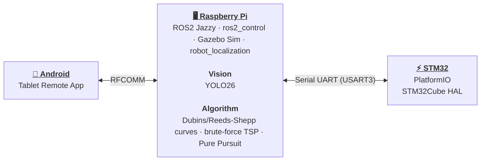

# 🏎️ Multi-Disciplinary Project (MDP)

> **Group 14**  
> *College of Computing & Data Science (CCDS) — AY2026/2027 Semester 1*

---

<strong>Fig. 1</strong> — System Architecture

## 🔌 Subsystems

| Subsystem | Code |
| --- | --- |
| 📱 [**Android**](android/index.md) | separate repo, not part of this monorepo |
| 🖥️ [**Raspberry Pi**](rpi/index.md) | `mdp_ros/` |
| 👁️ [**Vision**](rpi/vision.md) | `mdp_ros/src/mdp_vision/mdp_yolo/` |
| 🧭 [**Algorithm**](rpi/algorithm.md) | `mdp_ros/src/mdp_algorithm/` |
| ⚡ [**STM32**](stm32/index.md) | `mdp_stm32/` |

---

## 📚 Other Docs

| Section | Description |
| --- | --- |
| ▶️ [**Quickstart**](quickstart.md) | Commands-only runbook to get the robot driving — sim or real hardware. |
| 📋 [**Assessment & Checklist**](assessment_checklist.md) | Official course deliverables (Module A, B, C), deadlines, and Task 1 & 2 requirements. |
| 🔧 [**Hardware Components**](hardware.md) | Component list, physical specs, and drivetrain parameters. |
| 🔄 [**Dev Workflow & Setup**](dev_workflow.md) | Branch/commit conventions, the dev loop, and the optional OpenSpec workflow. |
| 🚨 [**Troubleshooting**](troubleshooting.md) | Known issues and git submodule help. |
| 📖 [**References**](references.md) | External tool documentation links and WHEELTEC vendor file directory map. |
