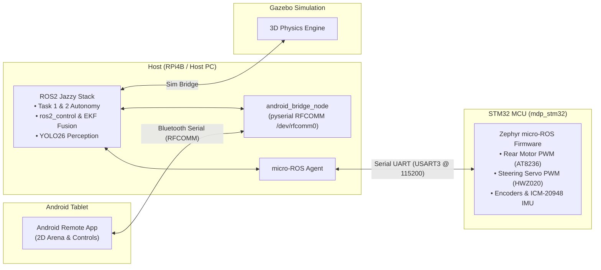

# Multi-Disciplinary Project (MDP)

> **ROS2 Jazzy + STM32 Ackermann Autonomous Robot**  
> *College of Computing & Data Science (CCDS) — AY2026/2027 Semester 1*

Welcome to the central documentation hub for the MDP Ackermann Autonomous Robot. This monorepo manages documentation, shared environment tooling (`pixi`), and two dedicated git submodules for host software (`mdp_ros`) and MCU firmware (`mdp_stm32`).

---

## 👥 Team Members & Roles

Below is the team structure for the MDP robot development across hardware, firmware, control, and autonomy:

| Subsystem Role | Team Member(s) | Key Focus & Responsibilities |
| --- | --- | --- |
| **Algorithm** | **Rashi** | A* grid search, Reeds-Shepp curve planner, TSP solver, and Pure Pursuit waypoint follower. |
| **Android** | **Albert** | Android tablet Bluetooth serial interface, 2D arena grid GUI, obstacle setup, and status updates. |
| **Raspberry Pi** | **Wei Ming, Katie** | `mdp_ros` workspace bringup, `ackermann_steering_controller` setup, and `robot_localization` EKF sensor fusion. |
| **STM32** | **HC, SL** | `mdp_stm32` Zephyr firmware, AT8236 motor PWM, HWZ020 steering servo, encoders, IMU, and micro-ROS serial transport. |
| **Vision** | **Kaegan** | RPi Camera V2 integration, Ultralytics YOLO arrow/symbol detection node, and image streaming. |

---

## 🗺️ High-Level System Architecture

The robot uses a **Host-Side Kinematics** architecture where the STM32 MCU acts as a pure hardware I/O controller, while all kinematics and sensor fusion run on the ROS2 host:



---

## 📦 Submodule Workspaces

The codebase is split into two independently versioned git submodules:

=== "🤖 ROS Host Software (`mdp_ros`)"

    - **Platform:** ROS2 Jazzy (`robostack-jazzy` pixi channel) on RPi4B / Host PC.
    - **Responsibilities:** URDF robot model, Gazebo 3D simulation, `ros2_control`, path planning (Reeds-Shepp / Dubins), YOLO26 vision, and task state machines.
    - **Guide:** [ROS Workspace Documentation](ros/index.md)

=== "⚡ STM32 MCU Firmware (`mdp_stm32`)"

    - **Platform:** Zephyr RTOS v4.0.0 on WHEELTEC C30D V2.1 board (STM32F407VET6 MCU).
    - **Responsibilities:** AT8236 motor PWM driver, HWZ020 steering servo PWM, Hall encoder reading, ICM-20948 IMU reading, and micro-ROS serial transport.
    - **Guide:** [STM32 Firmware Documentation](stm32/index.md)

---

## 🚀 Developer Setup

```bash title="1. Clone with submodules and install root pixi environment"
git clone --recurse-submodules <this-repo-url>
cd mdp
pixi install
```

```bash title="2. Set up STM32 firmware toolchain (mdp_stm32)"
cd mdp_stm32
pixi run setup     # Downloads ARM SDK, fetches Zephyr modules, applies patches
pixi run probe     # Sanity check: detect ST-LINK/V2 + STM32F407 chip
cd ..
```

```bash title="3. Initialize OpenSpec CLI (Per submodule)"
cd mdp_ros         # Repeat for mdp_stm32
openspec init
cd ..
```

---

## 📚 Documentation Sitemap

| Section | Description |
| --- | --- |
| 📐 [**System Architecture & ADRs**](architecture.md) | Deep-dive technical stack, sequence diagrams, sensor fusion, and architectural decisions (ADRs 0001–0006). |
| 🔄 [**Dev Workflow & Setup**](dev_workflow.md) | OpenSpec CLI guide, `/opsx:` explore/propose/apply/archive loop, and git branch rules. |
| 🔧 [**Hardware Components**](hardware.md) | Component list, physical specs, CAD kingpin geometry, and drivetrain parameters. |
| 📋 [**Assessment Checklist**](assessment_checklist.md) | Official course deliverables (Module A, B, C), deadlines, and Task 1/2 requirements. |
| 🚨 [**Troubleshooting**](troubleshooting.md) | Known issues, OpenSpec CLI fixes, micro-ROS agent build solutions, and git submodule help. |
| 📖 [**References**](references.md) | External tool documentation links and WHEELTEC vendor file directory map. |