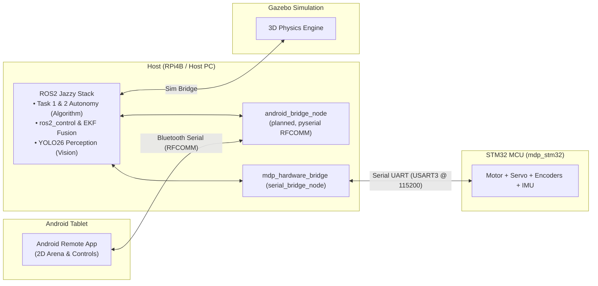

# Multi-Disciplinary Project (MDP)

> **Group 14**  
> *College of Computing & Data Science (CCDS) — AY2026/2027 Semester 1*

Welcome to the central documentation hub for the MDP Ackermann Autonomous Robot. Docs are organized
**one folder per subteam** — pick your team below, or start with the [Architecture Guide](architecture.md)
for how everything talks to everything else.

---

## 👥 Team Members & Subteams

| Subteam | Team Member(s) | Key Focus & Responsibilities | Docs |
| --- | --- | --- | --- |
| **Algorithm** | **Rashi** | A* grid search, Reeds-Shepp curve planner, TSP solver, and Pure Pursuit waypoint follower. | [Algorithm docs](algorithm/index.md) |
| **Android** | **Albert** | Android tablet Bluetooth serial interface, 2D arena grid GUI, obstacle setup, and status updates. | [Android docs](android/index.md) |
| **Raspberry Pi** | **Wei Ming, Katie** | `mdp_ros` workspace bringup, `ackermann_steering_controller` setup, and `robot_localization` EKF sensor fusion. | [RPi docs](rpi/index.md) |
| **STM32** | **HC, SL** | `mdp_stm32` PlatformIO/STM32Cube HAL firmware, motor PWM, steering servo, encoders, IMU, and the custom binary serial protocol. | [STM32 docs](stm32/index.md) |
| **Vision** | **Keagan** | RPi Camera V2 integration, Ultralytics YOLO arrow/symbol detection node, and image streaming. | [Vision docs](vision/index.md) |

---

## 🗺️ High-Level System Architecture

The robot uses a **Host-Side Kinematics** architecture — the STM32 MCU is a pure hardware I/O
controller; all kinematics, sensor fusion, vision, and path planning run on the RPi host. Full detail
(data flow diagrams, ADRs) is in the [Architecture Guide](architecture.md) — this is just the map of
who talks to whom:



---

## 📦 Codebase Layout

Two independently versioned git submodules hold all the actual code; Vision and Algorithm live as
ROS2 packages *inside* `mdp_ros` rather than as separate submodules, and Android's app code lives in
its own separate repo (not part of this monorepo):

=== "🤖 `mdp_ros` — RPi, Vision, Algorithm"

    - **Platform:** ROS2 Jazzy (`robostack-jazzy` pixi channel) on RPi4B / Host PC.
    - **Contains:** URDF robot model + bringup (RPi), `mdp_control`/`wayp_plan_tools` path planning (Algorithm), `vision` package (Vision), and the STM32 hardware bridge.
    - **Guides:** [RPi](rpi/index.md) · [Vision](vision/index.md) · [Algorithm](algorithm/index.md)

=== "⚡ `mdp_stm32` — STM32"

    - **Platform:** PlatformIO + STM32Cube HAL on WHEELTEC C30D V2.1 board (STM32F407VET6 MCU).
    - **Contains:** Motor/servo PWM drivers, encoder + IMU reading, closed-loop wheel PID, and the custom binary serial protocol.
    - **Guide:** [STM32](stm32/index.md)

=== "📱 Android app — not in this repo"

    - Built/maintained separately by the Android subteam.
    - **Guide:** [Android](android/index.md) — documents the interface contract other subteams depend on.

---

## 🚀 Developer Setup

```bash title="1. Clone with submodules and install root pixi environment"
git clone --recurse-submodules <this-repo-url>
cd mdp
pixi install
```

```bash title="2. Pull the latest changes (parent repo + both submodules)"
pixi run update
```

Per-subteam setup (toolchain install, OpenSpec init, build/flash) lives with each submodule's own docs, not here:

- **RPi / ROS2** (`mdp_ros`) — see [RPi docs](rpi/index.md)
- **STM32** (`mdp_stm32`) — see [STM32 docs](stm32/index.md)
- **OpenSpec CLI** (both submodules) — see [Dev Workflow & OpenSpec Setup](dev_workflow.md)

---

## 📚 Documentation Sitemap

**By subteam:**

| Subteam | Page |
| --- | --- |
| 🧭 Algorithm | [algorithm/index.md](algorithm/index.md) |
| 📱 Android | [android/index.md](android/index.md) |
| 🖥️ RPi | [rpi/index.md](rpi/index.md) · [Launch Files](rpi/launch.md) · [Gazebo Sim](rpi/simulation.md) · [Sensor Fusion](rpi/sensor_fusion.md) |
| ⚡ STM32 | [stm32/index.md](stm32/index.md) · [Pinouts](stm32/pinouts.md) · [Drivers](stm32/drivers.md) · [Serial Protocol](stm32/protocol.md) · [Closed-Loop Control](stm32/control_loop.md) |
| 👁️ Vision | [vision/index.md](vision/index.md) |

**Cross-cutting (not one subteam's):**

| Section | Description |
| --- | --- |
| 📐 [**Architecture Guide**](architecture.md) | System stack, data-flow diagrams, and architectural decisions (ADRs 0001–0006). Who talks to whom, not implementation detail. |
| 📋 [**Assessment & Checklist**](assessment_checklist.md) | Official course deliverables (Module A, B, C), deadlines, and Task 1/2 requirements. |
| 🔧 [**Hardware Components**](hardware.md) | Component list, physical specs, and drivetrain parameters — used by both RPi (URDF/kinematics) and STM32 (drivers). |
| 🔄 [**Dev Workflow & Setup**](dev_workflow.md) | OpenSpec CLI guide, `/opsx:` explore/propose/apply/archive loop, and git branch rules. |
| 🚨 [**Troubleshooting**](troubleshooting.md) | Known issues, OpenSpec CLI fixes, and git submodule help. |
| 📖 [**References**](references.md) | External tool documentation links and WHEELTEC vendor file directory map. |
