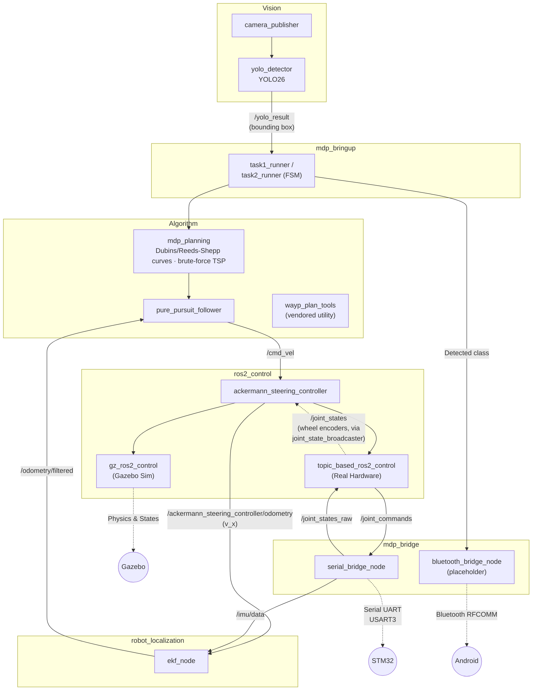
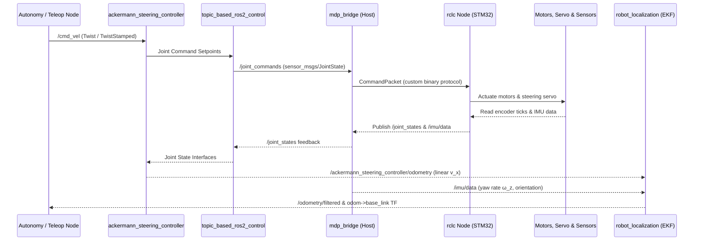

# Raspberry Pi (`mdp_ros`)

Vision and Algorithm are ROS2 packages inside `mdp_ros`, not separate hardware like Android/STM32.

## RPI System Overview

Expanding the "Raspberry Pi" box from the [System Overview](../index.md) diagram — data flow between
Vision, Algorithm, `ros2_control`, and sensor fusion, all running on the RPi:


<p align="center"><strong>Fig. 1</strong> — RPI System Overview</p>

## End-to-End Control & Telemetry Sequence


<p align="center"><strong>Fig. 2</strong> — End-to-End Control & Telemetry Sequence</p>

## Learn More

| Topic | What it covers |
| --- | --- |
| [**Launch Files & Topics**](ros2_jazzy.md) | `sim.launch.py`/`real.launch.py` entry points and every topic in the graph. |
| [**ROS2 Control**](ros2_control.md) | The `ros2_control` hardware-abstraction framework, Ackermann controller params, Gazebo plugin setup, URDF joint limits. |
| [**ROS2 EKF Localization**](ros2_ekf_localization.md) | How `robot_localization`'s EKF fuses wheel odometry + IMU into drift-free pose. |

## ROS2 Packages

```text
mdp_ros/
└── src/
    ├── mdp_description/         # URDF robot models, meshes, Gazebo worlds (Sim & Real Hardware variants)
    ├── mdp_algorithm/           # (Algorithm) - see algorithm.md
    │   ├── mdp_planning/        # Reeds-Shepp/Dubins curve + TSP solver, pure-pursuit follower
    │   └── wayp_plan_tools/     # vendored waypoint/planner utilities
    ├── mdp_vision/              # (Vision) - see vision.md
    │   ├── mdp_yolo/            # camera publisher + YOLO detector
    │   ├── libcamera/           # external, gitignored - cloned on the Pi, real hardware only
    │   └── camera_ros/          # external, gitignored - cloned on the Pi, real hardware only
    ├── mdp_bridge/              # STM32 serial bridge (serial_bridge_node) + Android Bluetooth
    │                            # bridge (bluetooth_bridge_node, placeholder)
    └── mdp_bringup/             # launch files, controller configs, Task 1 & 2 runner scripts

# Installed via `pixi install` (rosdep/apt packages, not in src/):
#   gz_ros2_control, ros_gz_*                                   ..... Gazebo Sim + ROS2 bridge
#   ros2_control, ackermann_steering_controller, topic_based_ros2_control
#   robot_localization                                          ..... EKF (ekf_node)
```
<p align="center"><strong>Fig. 3</strong> — ROS2 Packages</p>

## TODO

- [x] `mdp_description` + `mdp_bringup` — URDF models, meshes, launch files, and controller YAMLs
- [x] Gazebo Simulation — `mini_akm_robot.urdf` with `gz_ros2_control`
- [x] Real Hardware Integration — `mini_akm_real_robot.urdf` with `topic_based_ros2_control`
- [x] Autonomy & Planning Nodes — Reeds-Shepp planner, Dubins pure pursuit follower, YOLO arrow detector, Task 1 & 2 state machines (see [Algorithm](algorithm.md), [Vision](vision.md))
- [ ] `robot_localization` EKF Node — `ekf.yaml` + `real.launch.py` wiring fusing `/ackermann_steering_controller/odometry` (v_x) + `/imu/data` (yaw, ω_z) into `/odometry/filtered`; a stationary-robot hardware run found `y`/`yaw` covariance growing unbounded, not yet root-caused (see [Known Issue](#known-issue-odometryfiltereds-y-and-yaw-covariance-grow-unbounded)) — **do not trust `/odometry/filtered` beyond short manual test drives yet**
- [x] `ekf.yaml` `imu0_config` switched to fuse only `angular_velocity` (yaw rate), not `orientation` — previously fused both, double-counting the MCU's own uncorrected gyro-integrated yaw as if it were an independent measurement; not yet re-validated on physical hardware after the change. See [STM32: IMU Data Flow](../stm32/tuning.md#imu-ros2_control-robot_localization-data-flow)
- [x] `ekf.yaml` `frequency` raised 30Hz → 100Hz to match `mdp_stm32`'s telemetry rate — not yet re-validated on hardware

---

See [Quickstart](../quickstart.md) for every `pixi run` command (setup, launch, drive, standalone
`mdp_bridge`) — this page stays theory-only from here on.

## EKF Verification Checklist (post-bringup)

**No driving needed (wheels can be off the ground):**

1. `pixi run real serial_port:=/dev/ttyACM0` (adjust device as needed) and confirm no node exits/crashes on startup.
2. `ros2 topic hz /imu/data` and `ros2 topic hz /ackermann_steering_controller/odometry` — should read ~10Hz and ~50Hz respectively (matching the MCU telemetry rate and `controller_manager`'s `update_rate`). If either is 0, the EKF has nothing to fuse — go fix that input first, not the EKF config.
3. `ros2 topic echo /odometry/filtered --once` — check `pose.pose.position`/`orientation` are real numbers, not `nan`. A `nan` here usually means `frequency`/`sensor_timeout` never saw a first message from one of the inputs.
4. **TF ownership** — confirm `ekf_node` is the only `odom`→`base_link` broadcaster: `ros2 topic echo /tf` and check the source, or watch the terminal for `TF_REPEATED_DATA`/multiple-authority warnings, which would mean `real_controller.yaml`'s `enable_odom_tf: false` didn't take (e.g. stale `install/` from before the config change — rebuild and re-source).
5. **IMU branch in isolation** — with wheels stationary (0 encoder ticks), rotate the whole chassis by hand. `/odometry/filtered`'s yaw should track the rotation via the IMU while `vx` stays ~0. If yaw doesn't move, the IMU input isn't reaching the filter (check `/imu/data` is actually populated, not zeros — `imu_ready` must be 1).
6. **Wheel branch in isolation** — chassis stationary/level, spin one rear wheel by hand. `/odometry/filtered`'s `twist.linear.x` should respond without a spurious yaw jump (yaw only comes from the IMU input, per the fusion table in [ROS2 EKF Localization](ros2_ekf_localization.md#this-robots-specific-fusion)).
7. `ros2 run rviz2 rviz2`, add a TF display (or Odometry display on `/odometry/filtered`) — visually confirm `odom`→`base_link` moves smoothly, without snapping or jitter, as you manually rotate/roll the chassis.

**Needs actual driving:**

8. Drive a short known path with `pixi run teleop` (e.g. forward 1m, turn 90°, forward 1m) and compare `/odometry/filtered`'s reported displacement against a tape-measure ground truth. Some drift is expected (no absolute correction source yet — see `world_frame` note in [ROS2 EKF Localization](ros2_ekf_localization.md#this-robots-specific-fusion)); the goal is confirming the fused estimate is *closer* to ground truth than raw `/ackermann_steering_controller/odometry` alone, not perfect.

---

## Not Yet Verified On Hardware

- EKF fusion (`ekf.yaml`) — config-validated only (`ekf_node` runs cleanly against the params file, launch file parses); not yet run against the live serial bridge + physical IMU/encoders per the checklist above.

## Known Issue: `/odometry/filtered`'s `y` and `yaw` covariance grow unbounded

First real-hardware run of the EKF (stationary robot, ~5 min) showed `pose.covariance`'s `x` term behaving reasonably (~34 → ~52, slow growth) but `y` and `yaw` diverging continuously and never settling:

| | t+0 | t+21s |
| --- | --- | --- |
| `x` covariance | 34.4 | 51.7 |
| `y` covariance | 7.7×10¹⁰ | 5.9×10¹¹ |
| `yaw` covariance | 2.2×10⁶ | 7.4×10⁶ |

**Ruled out:**

- Not a startup-transient / "hasn't converged yet" thing — covariance keeps climbing indefinitely across multiple snapshots minutes apart, never plateaus.
- Not `ekf_node` falling behind (`Failed to meet update rate!`) — that run showed zero such warnings from `ekf_node`.
- Not a serial/IMU dropout — `serial_bridge_node`'s diagnostic showed a steady `~3600 bytes, 25-26 OK frames, 0 bad frames` every 3s the entire run; `/imu/data` was flowing continuously.

**Working theory:** `imu0_config`'s `yaw: true` isn't actually correcting the filter's yaw estimate — if it were, yaw's own covariance should plateau near the IMU's reported yaw covariance (`0.05`, set in `serial_bridge_node.cpp`'s `onTelemetry()`), not grow unboundedly. Unfused/uncorrected yaw uncertainty compounding into `y` position uncertainty through the motion model would explain why `y` is ~5 orders of magnitude worse than `x` (which *is* corrected every cycle via `vx` from wheel odometry).

**Next diagnostic step (not yet done):** `ros2 topic echo /diagnostics --once` while `pixi run real` is running - `ekf_node` (`print_diagnostics: true` in `ekf.yaml`) publishes a per-input health entry (e.g. `ekf_filter_node: imu0 (/imu/data)`) that should say directly whether `imu0` is being read/accepted or timing out/rejected, rather than inferring it from covariance numbers alone.
