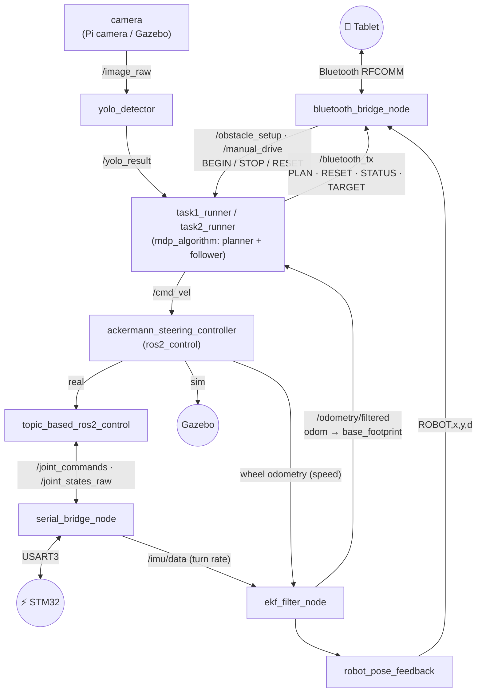

# Raspberry Pi (`mdp_ros`)

ROS 2 Jazzy, built with pixi. The same code runs the real car (on the Pi) and the Gazebo sim (on a
laptop); only the layer that moves the wheels differs. Commands: [Quickstart](../quickstart.md).

## How it fits together


```mermaid
graph TD
  TAB(("📱 Tablet")) <-->|"Bluetooth RFCOMM"| BT["bluetooth_bridge_node"]
  BT -->|"/obstacle_setup · /manual_drive<br/>BEGIN / STOP / RESET"| RUN
  RUN -->|"/bluetooth_tx<br/>PLAN · RESET · STATUS · TARGET"| BT
  RPF["robot_pose_feedback"] -->|"ROBOT,x,y,d"| BT

  CAM["camera<br/>(Pi camera / Gazebo)"] -->|"/image_raw"| YOLO["yolo_detector"]
  YOLO -->|"/yolo_result"| RUN["task1_runner / task2_runner<br/>(mdp_algorithm: planner + follower)"]

  RUN -->|"/cmd_vel"| ASC["ackermann_steering_controller<br/>(ros2_control)"]
  ASC -->|"real"| TBS["topic_based_ros2_control"] <-->|"/joint_commands · /joint_states_raw"| SER["serial_bridge_node"] <-->|"USART3"| STM(("⚡ STM32"))
  ASC -->|"sim"| GZ(("Gazebo"))

  ASC -->|"wheel odometry (speed)"| EKF["ekf_filter_node"]
  SER -->|"/imu/data (turn rate)"| EKF
  EKF -->|"/odometry/filtered<br/>odom → base_footprint"| RUN
  EKF --> RPF
```
<p align="center"><strong>Fig. 1</strong> — The ROS graph (real car; in sim Gazebo replaces the STM32, camera and IMU)</p>

## Packages

| Package | Type | What's in it |
| --- | --- | --- |
| `mdp_bringup` | Python | **Launch + config + the task nodes.** `launch/mdp.launch.py` (everything), `launch/vision.launch.py`; `config/` (all settings); nodes in folders: `tasks/` (`task1_runner`, `task2_runner` on a shared `runner_base`), `robot/` (`robot_pose_feedback`, `manual_drive`, `health_monitor`, `bag_recorder`, `bt_monitor`), `sim/` (`sim_helpers`); `tools/` (`trigger`, `publish_obstacles`, `calib`, `around_obstacle`) |
| `mdp_algorithm` | Python library | Costmap, Hybrid A*, visit order, pure pursuit: [Algorithm](algorithm.md) |
| `mdp_vision` | Python | `rpi_cam_publisher` (Pi camera), `yolo_detector`, the YOLO models: [Vision](vision.md) |
| `mdp_bridge` | C++ | `serial_bridge_node` (STM32), `bluetooth_bridge_node` (tablet) |
| `mdp_description` | CMake | The car: `urdf/mdp_robot.urdf.xacro` (one file, sim and real), meshes, arenas `worlds/task1_arena.sdf` / `task2_arena.sdf`, symbol images |
| `mdp_interfaces` | CMake | One message: `RunStatus` (`/run_status`, the runners' live state) |

From pixi, not in `src/`: `ros2_control` + `ackermann_steering_controller`,
`topic_based_ros2_control`, `gz_ros2_control` + `ros_gz`, `robot_localization`, `foxglove_bridge`.

## Where settings live

| File | Holds |
| --- | --- |
| URDF `mdp_description/urdf/mdp_robot.urdf.xacro` | The car's measured size and steering limits, sensor positions (one copy; the launch copies them into the controller and planner) |
| `mdp_bringup/config/navigation.yaml` | Everything that drives the car: footprint, turning circles, costmap, planner, follower, speeds |
| `config/tasks.yaml` | Obstacle layouts (task 1 + 2), used by both Gazebo and the planners |
| `config/controller.yaml` · `ekf.yaml` | ros2_control · localisation |
| `config/bridges.yaml` · `vision.yaml` | Serial / Bluetooth devices · camera and YOLO |

All measured values, and how to re-measure them: [Quickstart → Measured car numbers](../quickstart.md#7-measured-car-numbers).

## Frames (REP-105)

```text
map ──(static: the start pose)──▶ odom ──(EKF)──▶ base_footprint ──(URDF)──▶ base_link ──▶ wheels, imu_link, camera_link
```

- `map` = the arena: origin at the bottom-left corner, x right, y up. Cells are 10 cm.
- `base_link` = **middle of the rear axle**, at axle height. The car's pose, the start cell, the
  planner and the tablet's `ROBOT` line all mean this point.
- `odom` is placed at the start pose, so `map → odom` is a fixed transform from `start_cell`.

## Learn more

| Page | Covers |
| --- | --- |
| [Launch & Topics](ros2_jazzy.md) | What `pixi run sim` / `pi` / `pi-solo` / `laptop` start, and every topic and service |
| [ROS2 Control](ros2_control.md) | The controller, sim vs real hardware plugins, same-angle steering |
| [EKF Localization](ros2_ekf_localization.md) | How the pose is estimated, and reset |
| [Algorithm](algorithm.md) | Planning and path following |
| [Vision](vision.md) | Camera and YOLO |
| [Simulation Symbol Assets](sim_assets.md) | The symbol images on the Gazebo blocks |

## Still to check on the real car

- [ ] Turning circles: `pixi run calib turn left` / `right`; they're only measured in sim so far.
- [ ] Camera mounted at the middle of the chassis, then measured into the URDF.
- [ ] Wheel size re-checked with `calib straight`, heading with `calib rotate 90`.
- [ ] A full task 1 run with the tablet.
