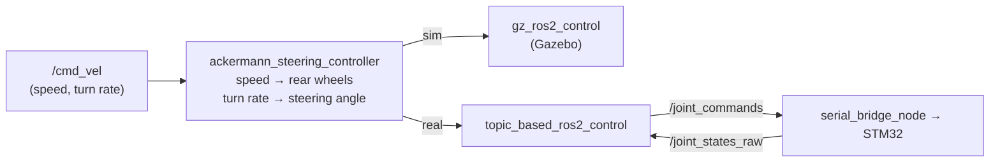

# ROS2 Control

`ros2_control` splits driving into a **controller**, which does the car's kinematics, and a
**hardware plugin** below it, which moves the wheels. We use the same controller in sim and real;
only the plugin changes, chosen by the URDF's `sim` argument.

| | Sim | Real |
| --- | --- | --- |
| Plugin | `gz_ros2_control/GazeboSimSystem` | `topic_based_ros2_control/TopicBasedSystem` |
| Controller manager | runs inside Gazebo | `ros2_control_node` |
| `/cmd_vel` remap | in the URDF's Gazebo plugin tag | on `ros2_control_node` in the launch |
| Joint feedback | Gazebo | `/joint_states_raw` from `serial_bridge_node` (kept off `/joint_states`, which `joint_state_broadcaster` owns) |

## Settings: `mdp_bringup/config/controller.yaml`

One file for sim and real. The car's dimensions are **not** in it: `mdp.launch.py` copies
`wheelbase`, `traction_track_width` (rear track) and the wheel radii from the URDF when it starts,
so they exist once.

| Setting | Value | Why |
| --- | --- | --- |
| `steering_joints_names` | `[right_joint, left_joint]` | Right first: the order the library expects |
| `traction_joints_names` | `[rb_joint, lb_joint]` | Rear wheels |
| `steering_track_width` | `0.0001` (~0) | **Both front wheels have the same angle** (one servo drives the right wheel, a tie rod the left). A real width would make the controller split the angle into inner/outer Ackermann angles the car can't do. `0.0` itself means "use the rear track", hence 0.0001. |
| `enable_odom_tf` | `false` | The EKF publishes `odom → base_footprint`, not the controller |
| `twist_covariance_diagonal` | turn rate `1.0`, rest `0.01` | Tells the EKF not to trust the wheels' turn rate: it takes that from the IMU ([EKF](ros2_ekf_localization.md)) |
| `reference_timeout` | `10.0` s | |

## Steering limits

The URDF steering joints are limited to the measured **43.0° left / 32.5° right** (`steer_left` /
`steer_right`), the same values as the STM32's clamp (`mdp_stm32/include/servo.h`) and the planner.
Positive = left (REP-103). Measured values and how: [Quickstart → Measured car numbers](../quickstart.md#7-measured-car-numbers).

Because both wheels turn to the same angle, the tyres scrub, and the car turns **wider** than
wheelbase ÷ tan(angle). The planner therefore uses the *measured* turning circle
(`pixi run calib turn left|right`), not the formula.
