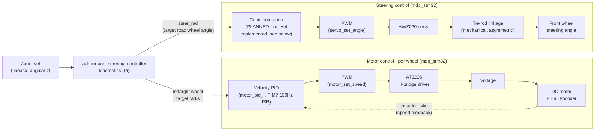

# Closed-Loop Wheel Control & Sensor Fusion (Planning)

## Overview: motor + servo control flow

Same shape as WHEELTEC's own motor-control flow diagram (`STM32运动底盘开发手册`, 图 6-4), adapted to
this project's actual hardware — 2 driven wheels (A=left, B=right, matching the diagram's note that
Ackermann chassis only use motors A/B) and 1 steering servo, with the servo path's cubic correction
stage marked as planned (see section 2 below) since it isn't implemented yet:



!!! note "Only 2 motors, 1 servo - no C/D motors or omni/mecanum paths"
    WHEELTEC's own diagram (图 6-4) covers up to 4 drive motors for their omni/mecanum chassis
    variants, with a note that differential and Ackermann chassis only use motors A/B and the X/Z
    target axes. This project is Ackermann-only, so that's the only row that applies here.

!!! warning "Status: implemented, NOT yet bench-tested — test/tune this before anything else"
    Section 1's closed-loop wheel PID is now **implemented** in `mdp_stm32` (`motor_pid_init` /
    `motor_pid_enable` / `motor_pid_set_target` / `motor_pid_get_measured_rad_s` / `motor_pid_pause`
    / `motor_pid_resume` in `motor.c`, wired into `main.c` and `selftest.c`) but has **never run on
    physical hardware** — `MOTOR_PID_KP=4.0f`/`MOTOR_PID_KI=0.5f` are untuned placeholder guesses.
    **Next action: flash it and bench-tune with the wheels off the ground before building anything
    else on top of it** (servo calibration, further `mdp_stm32` work, etc. can wait). Section 2
    (servo range) and section 3 (IMU → EKF flow, config already applied in `ekf.yaml`) are otherwise
    unaffected and can be done independently, but PID tuning is the priority right now.

    Cross-referenced against WHEELTEC's own C30D vendor firmware
    (`references/WHEELTEC/.../R550_C30D(2.0)_..._霍尔编码器_2025.12.26.zip`) to ground the control-law
    shape in a working reference implementation for this exact board/motor/encoder combo — gain
    *values* were not transferable (different PWM/tick scale), only the incremental-PI structure.

### Bench-tuning procedure (do this first)

1. Flash (`pixi run flash`), get the robot up on blocks so the wheels spin free.
2. Send a step target via ROS (`ros2 topic pub /joint_commands ...` with a fixed `velocity` for
   `lb_joint`/`rb_joint`) or a temporary direct test in firmware — watch actual wheel behavior.
3. Start from `MOTOR_PID_KI = 0` (pure P + feedforward). Raise `MOTOR_PID_KP` until the wheel
   tracks a step target quickly with acceptable overshoot (a little overshoot then settle is fine;
   visible oscillation/buzzing means back off).
4. Reintroduce `MOTOR_PID_KI` in small steps, just enough to kill any remaining steady-state error
   (commanded rad/s vs. `motor_pid_get_measured_rad_s()`'s reading not converging) — too much causes
   slow oscillation/overshoot growing over time.
5. Repeat for both wheels — since they're never perfectly matched, it's plausible (though not
   certain) the same gains work fine for both; watch for one wheel behaving worse than the other,
   which would call for asymmetric tuning instead of a shared `MOTOR_PID_KP`/`MOTOR_PID_KI`.
6. Once tuned on blocks, re-verify on the ground with the actual chassis weight/friction before
   trusting it for real runs — this is a meaningfully different load than free-spinning wheels.

## 0. Interrupt/timing architecture — why bare-metal is still OK, and where the line is

`mdp_stm32` coordinates several independent periodic/event-driven things by hand (NVIC priority +
shared `volatile` globals) instead of an RTOS scheduler + task priorities — same *shape* of problem
WHEELTEC solves with FreeRTOS tasks (see below), just without a scheduler enforcing correctness for
you. [ADR 0001](../architecture.md#0001-stm32cube-hal-bare-metal-via-platformio-vs-zephyr-rtos)'s
reasoning (bring-up speed, vendor-HAL compatibility, course timeline) still holds — this isn't a
recommendation to migrate. It IS a place mistakes are easy: an NVIC priority mix-up here already let
a button press theoretically preempt the motor safety loop (found and fixed below).

**Current ownership table** (NVIC priority number — lower runs first / can preempt higher numbers):

| Priority | Interrupt | Rate | Owns | File |
| --- | --- | --- | --- | --- |
| 1 (highest) | `TIM7` | 100 Hz, fixed period | Motor PID, encoder reads (`encoder_get_delta_a/b`), PWM output | `motor.c` |
| 2 | `USART3` (RX) | per-byte, ~115200 baud | Command packet framing (`g_last_command`) | `usart.c` |
| 3 (lowest) | `EXTI0` | on press | Button debounce flag | `button.c` |
| — (not an IRQ) | Main loop, fast tier | 100 Hz, tick-interval | Command/safety gating, IMU read, telemetry TX (interrupt-driven) | `main.c` |
| — (not an IRQ) | Main loop, slow tier | ~5 Hz, tick-interval | OLED render, debug `printf`, battery ADC, heartbeat LED | `main.c` |

**Rule for anything new**: actuator-driving/safety-relevant work gets the lowest priority *number*
(highest urgency); best-effort/human-facing work gets the highest number. If a new peripheral needs
its own precise timing (the ultrasonic/IR sensors on the roadmap are the obvious next candidate) and
it has to coordinate with the motor loop or encoders the way `selftest.c` now has to
(`motor_pid_pause()`/`resume()`), that's the point where hand-rolled coordination starts
multiplying — treat that as the signal to reconsider, not any point before it.

### Main loop timing allocation

The main loop used to bundle everything (IMU read, telemetry TX, OLED render, debug print, battery
ADC) into one `HAL_Delay(100)`-paced 10Hz pass — meaning IMU/encoder data reaching the Pi was
throttled to 10Hz even though the PID ISR samples encoders at 100Hz internally. Split into two
independent tick-interval tiers (`FAST_PERIOD_MS`/`SLOW_PERIOD_MS` in `main.c`, no blocking delay,
no RTOS):

| Tier | Rate | What's in it | Why this rate |
| --- | --- | --- | --- |
| Fast | **100 Hz** (`FAST_PERIOD_MS = 10`) | `imu_update()`, PID target/enable + safety gate, `servo_set_angle()`, telemetry build+send | Matches the motor PID's own 100Hz encoder sampling 1:1 - no information the PID measures gets throttled down before reaching the Pi. Only viable at this rate because `uart_send_telemetry()` is interrupt-driven (`HAL_UART_Transmit_IT`, `usart.c`) rather than blocking - a blocking transmit of the 54-byte telemetry packet takes ~4.7ms at 115200 baud, which would eat ~47% of a 10ms period on its own. Also shrinks worst-case motor-switch-off reaction time from ~100ms (pre-tiering) to ~20ms |
| Slow | ~5 Hz (`SLOW_PERIOD_MS = 200`) | OLED render, debug `printf`, battery ADC, heartbeat LED toggle | All either human-facing (no benefit refreshing faster than the eye uses) or slow-changing (battery voltage drifts over seconds/minutes) - also the two slowest operations (bit-banged OLED, blocking USART1 printf) |
| Always | every raw loop pass | Button/self-test-request check, OLED auto-page-advance check | Cheap enough not to need tiering |

**Why the motor PID itself stays at 100Hz** (i.e. why "maximize everything" doesn't mean raising
every rate): the encoder is 1560 ticks/rev, so at max speed (~5.5 rev/s) a 100Hz sample already only
covers ~85 ticks, and that number only gets *smaller* — and the measured velocity noisier — at the
low speeds this robot actually spends most of its time at during careful arena maneuvering. Raising
the PID rate further would trade real velocity-estimate resolution for a bigger number, not improve
control quality.

**Bandwidth check at 100Hz** (`USART3`, 115200 baud ≈ 11520 B/s): telemetry (54 bytes/packet) +
commands (16 bytes/packet, ~50Hz from the host) ≈ 6200 B/s combined, about 54% of capacity - real
margin remains. `USART1` (debug `printf`) is a physically separate UART peripheral and doesn't
compete for this bandwidth at all.

Battery voltage and measured wheel rad/s are cached in persistent locals so the slow tier can display
whatever the fast tier (rad/s) or the slow tier itself (battery) last read, without either tier
reading a resource it doesn't own out of turn.

### WHEELTEC's actual reference: FreeRTOS, task-based, not ad-hoc ISRs

Extracted directly from their firmware zip (not the marketing docs) - `BALANCE/balance.c`'s
`Balance_task` is a genuine periodic FreeRTOS task (`vTaskDelayUntil`, not an ISR) at the *highest*
priority in their whole system:

| Task | Rate | Priority | Role |
| --- | --- | --- | --- |
| `Balance_task` | 100 Hz (`vTaskDelayUntil`) | **4 (highest)** | Velocity PI + `Set_Pwm` - the motor control loop |
| `Check_task` | 100 Hz | 4 | Safety/battery monitoring |
| `ICM20948_task` | 100 Hz | 3 | IMU read |
| `show_task` | 10 Hz | 3 | OLED display |
| `pstwo_task` / `data_task` | - | 4 | Gamepad / serial I/O |
| `start_task` | once, deletes itself | 1 (lowest) | Bootstrap - spawns every other task |

The pattern worth taking away even without adopting RTOS: **the actuator-driving loop gets the
highest priority in the whole system**, `vTaskDelayUntil` gives it a jitter-free fixed period
regardless of what else runs, and everything lower-priority (display, telemetry) genuinely cannot
starve it - the scheduler enforces that structurally. This project's NVIC-priority table above is
the bare-metal approximation of the same idea, manually maintained instead of scheduler-enforced.

## 1. Closed-loop wheel speed — lives on the STM32, not the Pi/EKF

### Current state

`motor_set_speed_rad_s()` ([motor.c](../../mdp_stm32/src/motor.c)) is pure open-loop: target rad/s →
linear PWM% via the motor's rated max speed, no feedback. Actual wheel speed at a given PWM% drifts
with battery voltage, load, and the fact that the two motors are never perfectly matched (already
visible in `selftest.c`, which tracks and stops each wheel independently for exactly this reason).

### Why the STM32, not `robot_localization`'s EKF or the ROS2 host

- `robot_localization`'s EKF is a **state estimator**, not a controller — it fuses odometry/IMU into
  a pose estimate and has no path to emit a PWM/speed-correction signal at all.
- Closing the loop from the Pi means round-tripping over USART3 (bridge polls at whatever
  `readLoop()`/OS scheduling gives it, MCU telemetry currently at 10 Hz) — too much latency and
  jitter for a speed loop that should react within milliseconds of an encoder edge.
- The STM32 is the only point in the system with low-latency access to both sides of the loop
  (PWM timers + encoder counters) in the same control cycle.

### Reference: how WHEELTEC's own C30D firmware does it

Extracted and read directly from the vendor zip (`BALANCE/balance.c` + `BALANCE/control.c`), since
the pin/timer assignments and hardware in this project were already ported from it:

- The vendor firmware **does run FreeRTOS** (`FreeRTOS/` in the zip, tasks created in `USER/main.c`:
  `Check_task`, `Balance_task`, `IMU_task`, `show_task`, `led_task`, `pstwo_task`, `data_task`) —
  this project deliberately diverged from that (bare-metal HAL, [ADR 0001](../architecture.md#0001-stm32cube-hal-bare-metal-via-platformio-vs-zephyr-rtos)), so the *mechanism* below needs
  re-implementing without an RTOS, but the *control law* is directly reusable.
- The actual velocity loop runs inside `EXTI15_10_IRQHandler()` in `balance.c`, triggered by the
  MPU6050/ICM-20948's **INT (data-ready) pin**, which fires every 5 ms. It alternates: odd calls
  read attitude (`Read_DMP()`), even calls (**effectively every 10 ms, ~100 Hz**) read both encoders
  and run the velocity PI:

    ```c
    // control.c — Incremental_PI_A/B, called every 10ms from the IMU data-ready ISR
    Bias = Encoder - Target;                              // measured - target
    Pwm += Velocity_KP*(Bias-Last_bias) + Velocity_KI*Bias; // incremental PI
    // clamp to +/-7200 (their PWM/ARR scale), Last_bias = Bias
    ```

    Default gains in `system.c`: `Velocity_KP = 300`, `Velocity_KI = 300` (further tunable at
    runtime via their app/potentiometer — not fixed constants in practice). This applies to the
    Ackermann car variant too — `robot_select_init.c`'s `case Akm_Car:` uses the same `Robot_Init` /
    velocity-loop path as every other chassis type; car-selection only changes kinematics geometry
    (wheelbase, track, wheel diameter), not whether the PI loop runs.
- Note this is an **incremental** PI (accumulates `Pwm` across calls from `Bias` deltas), not a
  textbook positional PID — simpler to tune stably at a fixed sample rate and naturally rate-limits
  output changes, which matters for not stalling the AT8236's gate drive (see the locked-antiphase
  note in [Drivers](drivers.md#at8236-motor-driver-motorc)).

### Proposed plan for `mdp_stm32` (bare-metal, no RTOS, no MPU interrupt pin routed the same way)

1. **Decouple the motor control rate from the 10 Hz main loop.** Telemetry/OLED/IMU-read can stay at
   10 Hz; the wheel PI needs to run faster and on a fixed period — a free-running hardware timer
   (e.g. `TIM7`, currently unused) with an update interrupt at ~50–100 Hz is the bare-metal
   equivalent of WHEELTEC's IMU-data-ready-triggered ISR, without needing an actual sensor interrupt
   to hang the timing off of.
2. **In that ISR:** read `encoder_get_delta_a()`/`_b()` (already tick-since-last-call), convert to a
   measured rad/s using the existing `2*pi/1560` ticks→rad conversion, run one incremental-PI step
   per wheel against the current target (still delivered via `g_last_command`, unchanged), write the
   corrected PWM% via `motor_set_speed()`.
3. **Gains need rescaling, not literal copying** — WHEELTEC's `Velocity_KP/KI = 300` are tuned
   against their integer encoder/PWM scale (PWM clamp ±7200, different ARR, different tick math).
   Treat `300`/`300` as a *starting order of magnitude* to bench-tune from, not a direct port.
4. **Keep the existing safety layers wrapping the loop, don't let the PID fight them**: the 500 ms
   stale-command fail-safe (`uart_command_is_stale`) and the `PD3` motor ON/OFF switch check should
   still zero the PWM output unconditionally, ahead of/around the PID, exactly as `main.c` does today
   — the PID should never be able to override those.
5. Open question / to decide when implementing: exact `TIMx` and priority to use, and whether the
   per-wheel encoder read should stay in the new ISR (tight timing) or whether a shared volatile
   "latest delta" read at 10 Hz is precise enough — needs bench testing once built.

### Wheel-speed trim — a tool to reach for if one wheel is "no good" after PID tuning

**Not implemented yet — this is a documented option for later, only add it if the symptom below
actually shows up.** Even with a correctly-tuned per-wheel PID, the car can still drift/curve during
a commanded-straight run, because the PID only guarantees each wheel hits *its own encoder-measured*
target — it can't see a systematic mismatch the encoder is blind to (slightly different effective
wheel radius from manufacturing tolerance, uneven tire wear, one side gripping less, chassis
alignment). "Same rad/s per encoder" isn't the same as "same actual ground speed" if the wheels
themselves aren't identical.

WHEELTEC's own firmware hits this same problem *despite* also running a per-wheel PI loop
(`Incremental_PI_A/B`, section 1 above) — their fix is a simple manual trim, not a smarter control
loop: a single runtime value `LineDiffParam` (0-100, centered at 50 = no correction), applied as a
multiplier to the wheel *target* before the PI loop, boosting whichever side is lagging by up to 20%:

```c
// wheelCoefficient() in WHEELTEC's balance.c - conceptual reference, not our code
if (isLeftWheel  && diffparam >= 50) return 1.0f + 0.004f*(diffparam-50); // up to 1.2x
if (!isLeftWheel && diffparam <= 50) return 1.0f + 0.004f*(50-diffparam); // up to 1.2x
return 1.0f;
```

It's not auto-tuned or measured — the operator watches the car drive straight, sees which way it
drifts, and nudges the value until it stops.

**Proposed equivalent for `mdp_stm32`, if this symptom shows up after bench-tuning the PID:**

- Two simple constants (or one WHEELTEC-style centered 0-100 knob, either works) — e.g.
  `MOTOR_LEFT_TRIM`/`MOTOR_RIGHT_TRIM`, defaulting to `1.0f` (neutral, no change in behavior until
  touched).
- Applied to `left_rad_s`/`right_rad_s` **before** `motor_pid_set_target()` is called (`main.c`), so
  the trim adjusts what the PID is asked to track, not the PID itself — keeps the PID's own logic
  untouched.
- Tuned the same pragmatic way WHEELTEC does it: drive straight, watch which way it curves, nudge
  the trim on the lagging side, repeat — no closed-loop auto-detection needed, this is a manual knob
  by design (same reasoning as WHEELTEC's own choice not to over-engineer it).

**When to actually add this**: only if, after the PID is bench-tuned and tracking each wheel's own
target correctly, the car still visibly curves during a straight `/cmd_vel` command. If it drives
straight once the PID's tuned, this isn't needed at all — don't add it preemptively.

## 2. Servo range — the real vendor solution is an empirically-fit curve, not a linear gain

**Correction to an earlier note here**: WHEELTEC's `control.c` (`Kinematic_Analysis()`) computes the
servo pulse as a pure linear gain with no measured-limit clamp:

```c
Servo = SERVO_INIT - angle*K;   // K = 570.8f, no software clamp to a verified lock angle
```

— but this turns out to be their **simplified/older** example, not their actual documented
methodology. Their real answer, found in both the theory manual and their current `balance.c` source,
is that the servo-command-to-real-angle relationship is **not linear at all**, and they solve it with
an **empirically-measured cubic curve fit**, not a constant gain. Full breakdown below, since this is
the actual engineering answer to "why does one side need 27° commanded and the other 41° for the
same ~32.5° real angle."

### The real problem, in the vendor's own words

Translated from `轮式移动机器人的运动学模型.pdf`, Section 8 ("Supplementary note on the Ackermann
steering mechanism"):

> No mature mechanism exists that can make the inner and outer steering wheels' angles precisely
> satisfy the ideal Ackermann relationship (`cot(δ_outer) − cot(δ_inner) = track_width / wheelbase`)
> across the *entire* range — it can only be **approximated**, via a trapezoidal linkage or a
> derivative of one. [...] The servo acts as the driving element in the whole steering mechanism.
> There are two ways our products control the servo's rotation: (1) sending a PWM value that drives
> the servo directly, with no slider position sensor / no trapezoidal-linkage feedback; or (2) sending
> slider position information and using incremental PID to control the PWM magnitude, indirectly
> controlling the servo via closed-loop position control (requires a slider position sensor). Both
> cases are explained below.

This directly confirms what we found by measurement: **every simple rigid-linkage Ackermann steering
mechanism has this problem** — it isn't specific to this chassis being poorly built. The vendor
splits their fix into two cases depending on whether the hardware has a feedback sensor. This project
has no such sensor (open-loop PWM only), so their **case 1** below is the one that applies to us.

### Case 1 — no feedback (our situation): fit a curve from measured data, don't assume linearity

Translated, Section 8.1:

> In this case, we mainly investigate the relationship between the servo's rotation angle (which
> corresponds 1:1 with the PWM value) and the car's front wheel steering angle (using the left wheel
> as the reference), taking the high-spec Ackermann car as an example. First, plot a scatter graph
> from known data (measured experimentally) — see Figure 8-3. By inspection, it's clear the curve's
> trend can be fitted with a quadratic or cubic curve. For simplicity, MATLAB's curve-fitting toolbox
> can be used (type `cftool` at the MATLAB command line) to check the fit — a cubic curve was chosen
> here, since (avoiding overfitting) a higher-order fit generally does better — see Figure 8-4.
> Finally, looking at the fit result, the goodness-of-fit R² comes out close to 1 — the data fits
> well. See Figure 8-5.

**Their actual worked example** (steering angle in radians, read from the published scatter plot,
Figure 8-3 — this is for their "high-spec Ackermann" reference chassis, not this project's car, but
shows the method with real numbers):

| Steering angle (rad) | Servo PWM (µs) |
| --- | --- |
| -0.38 | 1100 |
| -0.36 | 1150 |
| -0.34 | 1200 |
| -0.24 | 1250 |
| -0.17 | 1350 |
| -0.09 | 1450 |
| 0.00 | 1500 |
| 0.02 | 1550 |
| 0.20 | 1650 |
| 0.37 | 1750 |
| 0.53 | 1800 |
| 0.60 | 1850 |

Note the data isn't symmetric around 0° either — same asymmetry pattern we found on our own chassis
(more travel available on one side than the other), and it isn't evenly spaced — it's whatever they
actually measured, not a synthetic/assumed spread.

**Their fitted cubic** (Figure 8-5, MATLAB `cftool`, model type `Poly3`):

```
f(x) = p1·x³ + p2·x² + p3·x + p4

p1 = -27.25   (95% CI: -723.1 to 668.6)
p2 = -443.1   (95% CI: -689.4 to -196.9)
p3 =  824.5   (95% CI:  690.7 to 958.2)
p4 =  1507

Goodness of fit: SSE = 4474, R² = 0.994, Adjusted R² = 0.9918, RMSE = 23.65
```

`f(x)` here maps *steering angle (radians) → PWM pulse width (µs)* directly — a single-stage cubic,
simpler than `balance.c`'s two-stage version (radians→servo-shaft-angle via cubic, then
servo-shaft-angle→PWM via a linear `Ratio`) found earlier in this doc, but the same underlying idea:
**fit the real measured curve, don't assume a straight line.** Both are valid implementation choices
for the same fix; which one to use is a matter of convenience, not correctness.

### Applying this to our own car — the actual plan

1. **Measure (commanded angle, real angle) pairs across the range, on each side separately** — not
   just the two full-lock extremes we already have. A handful of intermediate points per side
   (e.g. ~5-6 points spanning 0° to each side's max) is enough for a good cubic fit, mirroring the
   ~12-point spread in the vendor's own example above.
2. **Fit a cubic per side** (`numpy.polyfit(x, y, 3)` — no MATLAB needed, same underlying least-squares
   method `cftool` uses) and check the R² the same way they did, to confirm the fit is actually good
   before trusting it.
3. **Replace the single linear `SERVO_ANGLE_SCALE_RAD` conversion in `servo_set_angle()`** with the
   fitted cubic (evaluated per side, since we already know the two sides' curves differ) — same
   architectural slot `balance.c`'s `Angle_Servo = f(AngleR)` occupies, just fit to our own chassis's
   actual measured data instead of theirs.
4. This resolves both open questions from this session at once: the "diminishing angle per commanded
   unit near the limit" behavior (a cubic naturally captures that curvature, a linear gain can't) and
   the left/right asymmetry (fitting two separate cubics, one per side, handles it directly instead of
   patching it with a shared rate + different clamps).

Procedure for the physical measurement side (no special tools beyond a protractor / phone protractor
app):

1. Servo centers at boot (1500 µs / 0°) — confirm visually first.
2. Command a small angle via ROS (`ros2 topic pub /joint_commands ...` with a small `position`) and
   step outward in ~5° increments toward the current `SERVO_ANGLE_MAX_LEFT/RIGHT_RAD` limit.
3. Watch/listen at each step: a servo pushed past its mechanical lock either **stalls with an
   audible buzz/whine** (current spike, no visible motion) or the **steering knuckle binds/scrapes**
   against the chassis/wheel well before the servo horn itself stops turning.
4. The last angle with clean, unobstructed motion is the real max — set `SERVO_ANGLE_MAX_LEFT/RIGHT_RAD` a
   couple degrees under that, not exactly at it (stalling a servo repeatedly wears it out).
5. Check **both** left and right separately — Ackermann knuckles aren't always symmetric, so don't
   assume the ± range is equal.

:white_check_mark: **Calibrated on physical hardware**, via progressively finer sweeps ending in a
degree-by-degree (1° resolution, 1.5s/step) pass per side. Final operating limits:

| Side | `servo.h` constant | Value |
| --- | --- | --- |
| Right | `SERVO_ANGLE_MAX_RIGHT_RAD` | **41°** (~0.7156 rad) |
| Left | `SERVO_ANGLE_MAX_LEFT_RAD` | **27°** (~0.4712 rad) |

Stored in **radians**, not degrees — `servo_set_angle()`'s unit was changed to match REP-103 (ROS's
standard: SI units, radians for angles), the same convention `ackermann_steering_controller`/URDF/the
`CommandPacket`'s `steer_rad` field already use throughout the rest of the stack. `main.c` used to
convert the command packet's `steer_rad` to an internal "angle_deg" and back — that indirection (and
the ambiguity noted below about what "angle_deg" actually represented) is gone; degree literals are
kept only as comments next to each `_RAD` constant, since that's how they were physically measured.

Genuinely asymmetric, confirmed at 1° resolution, not a rough estimate — earlier coarse passes (5°
steps) suggested roughly right~30-35/left~25-30 before the fine sweeps narrowed each side down to
an exact confirmed value. `selftest.c`'s sweep helper (`servo_sweep_range()`) supports sweeping
either direction (ascending or descending) and any sub-range via `servo_set_angle_raw()`
(bypasses the operating clamp, calibration-only) — used repeatedly during this process to zoom into
each side's real limit without re-running the full range each time.

Note the `HWZ020`'s own **datasheet-rated** range (`docs/hardware.md`, official course component
spec) is ±22.35° — the operating value here exceeds that. The datasheet number describes the
servo's own internal rotational travel as a component; what was measured describes the actual wheel
steering angle achieved through *this chassis's specific linkage geometry* before physical
interference, which is a different (and larger) number. Both are legitimate, they're just answering
different questions — the chassis-measured value is what actually governs safe operation here since
it accounts for the real linkage, not just the bare servo spec.

**Implementation** (`servo.h`/`servo.c`, `selftest.c`): `servo_set_angle(float angle_rad)` clamps
asymmetrically — `+SERVO_ANGLE_MAX_RIGHT_RAD` / `-SERVO_ANGLE_MAX_LEFT_RAD` — while keeping a single
fixed `SERVO_ANGLE_SCALE_RAD` (~0.7854 rad, i.e. 45°) for the radians→microseconds conversion, so the
pulse-per-radian rate stays identical on both sides; only the clamp differs. `main.c` passes the
command packet's `steer_rad` straight through with no unit conversion; `selftest.c`'s sweep still
picks a step size in degrees for human-friendly config, converting once to radians at the top of the
file, and converts back to degrees only for the OLED readout (display-only, not the underlying unit).
The pulse range
(`SERVO_PULSE_MIN_US`/`MAX_US` = 600/2400µs) is kept at the widened value used during sweep testing
— that's the range the per-side clamps were actually validated against, reverting it to stock would
break the calibration rather than restore safety. The self-test sweep (phase 3) sweeps the left limit
first (`-27°`), then ascends slowly to the right limit (`+41°`), matching the confirmed values above.

### Command resolution — how finely the steering angle can actually be set

The smallest angular increment the firmware can command is set by the PWM timer's tick size, not by
either side's clamp:

- `TIM12`'s compare register only accepts whole microseconds (`PSC=83` on the 84MHz `TIM12CLK` gives
  exactly a 1MHz/1µs-tick counter) — the pulse width can't change by anything finer than 1µs.
- The pulse-to-angle rate is fixed and shared by both sides (`SERVO_ANGLE_SCALE_RAD`): 900µs of pulse
  span maps to 45°.
- **1µs = 45°/900 = exactly 0.05° (~0.000873 rad)** — the finest angular step the firmware can
  command, identical on both the left and right side, since it comes from the timer resolution and
  the shared conversion rate, not from either side's clamp value.

In terms of addressable positions across each side's full range: left (27°) has ~540 positions
(27/0.05), right (41°) has ~820 (41/0.05) — different *counts* purely because the ranges are
different sizes, but the *step size* between any two adjacent positions is the same 0.05° on both
sides. (This is separate from the servo's own internal potentiometer/gear resolution, which isn't
documented for the `HWZ020` — 0.05° is the ceiling the *firmware* can address, the servo itself could
plausibly be coarser, but not finer than what a 1µs pulse change can express.)

### Raw PWM pulse range and real-world angular precision

Everything above is in the *commanded* pulse-mapped unit. Now that the real steering angle achieved
at each commanded extreme is known (32.5° at both, from the mode analysis below), the actual raw
signal the servo receives, and the real-world precision that maps to, can be stated directly.

**Raw pulse width range actually used during normal operation** (`servo_set_angle()`, clamped to
`SERVO_ANGLE_MAX_LEFT/RIGHT_RAD` = 27°/41° commanded):

| | Commanded (invented unit) | Raw PWM pulse width |
| --- | --- | --- |
| Center | 0° | **1500µs** |
| Left limit | -27° | **960µs** (`1500 - 27/45 × 900`) |
| Right limit | +41° | **2320µs** (`1500 + 41/45 × 900`) |

So in operation the servo is driven across **960µs to 2320µs**, not the full 600-2400µs the pulse
range is configured to allow (that wider range exists for calibration probing past the operating
clamp, see `servo.c`) — the actual working span is narrower and asymmetric around the 1500µs center,
matching the asymmetric commanded clamp.

**Real-world angular precision per side**, now that both sides are known to reach the same 32.5°
real angle over different pulse spans:

| Side | Pulse span | Steps (1µs each) | Real angle covered | Real resolution per step |
| --- | --- | --- | --- | --- |
| Left | 540µs (960-1500) | 540 | 32.5° | **32.5/540 ≈ 0.0602°/step** |
| Right | 820µs (1500-2320) | 820 | 32.5° | **32.5/820 ≈ 0.0396°/step** |

Right has more steps to cover the same real angle, so its real-world resolution is finer (~0.04°) than
left's (~0.06°) — the opposite of what the raw commanded-unit resolution (identical 0.05° both sides,
previous section) would suggest. This is the concrete, real-angle version of the same asymmetry
discussed throughout this section: the commanded unit and the real angle don't scale together
identically per side.

### Resolved: URDF steering limit now matches the real measured steering angle

`mdp_description`'s URDF (`left_joint`/`right_joint`) previously had a symmetric `±0.39 rad`
(~±22.35°) limit — the `HWZ020` servo's bare datasheet spec, not this chassis's actual range.

Important distinction worth being explicit about: the firmware-side calibration above
(`SERVO_ANGLE_MAX_LEFT/RIGHT_RAD`, 27°/41°) is expressed in the *commanded* pulse-mapped unit
(`angle_deg`→radians, `servo_set_angle()`'s own convention) — it is **not** the real steering
angle, just the commanded value needed to reach the real physical lock point on each side.

**Session 1** — protractor measurement at the wheel, taken during a turn test, 4 raw readings:
left-as-inner 32.68°, right-as-inner 33.69°, left-as-outer 31.00°, right-as-outer 30.96°.

**Session 2** — a cleaner direct re-measurement: commanded the servo straight to each
firmware-clamped extreme (`SERVO_ANGLE_MAX_LEFT_RAD`/`RIGHT_RAD`) and held for 8s
(`selftest.c`'s `servo_sweep()`), measuring *both* wheels at *each* extreme, 4 more raw readings:

| Commanded position | Right wheel | Left wheel |
| --- | --- | --- |
| RIGHT max (+41° commanded) | 32.47119229° | 30.25643716° |
| LEFT max (-27° commanded) | 32.73522627° | 34.50852299° |

**Precision & mode analysis**: this is a single shared servo/linkage driving both front wheels —
the servo connects directly to the right wheel's knuckle, and the right wheel connects to the left
via a tie-rod. Both wheels are expected to reach the same real angle at full lock (not a true
trapezoidal-Ackermann inner/outer differential), so all 8 readings across both sessions are treated
as noisy samples of one true value. The servo's own command resolution floor is ~0.05° (1µs pulse
step), well finer than manual protractor reading precision, so the dominant error source is the
measurement itself, not the mechanism.

Rounding all 8 readings to the nearest 0.5°:

| Raw | Nearest 0.5° |
| --- | --- |
| 30.96375653 | 31.0 |
| 31.00271913 | 31.0 |
| 32.68055474 | 32.5 |
| 33.69006753 | 33.5 |
| 32.47119229 | 32.5 |
| 34.50852299 | 34.5 |
| 32.73522627 | 32.5 |
| 30.25643716 | 30.5 |

**32.5° is the mode** (3 of 8 readings agree there, vs. 2 for the next-most-common value, 31.0°) —
taken as the answer over the mean. Cross-checked independently using only the 4 right-wheel readings
(right is the directly-driven side, one linkage joint closer to the servo than left, so in principle
the more trustworthy measurement point even though session 1's right-wheel pair alone wasn't
particularly tight) — those 4 also mode to 32.5°, the same answer both ways. Final value:
**32.5° (0.5672 rad)**, symmetric on both sides.

`mdp_description/urdf/mini_akm_real_robot.urdf`'s `left_joint`/`right_joint` limits are now
`±0.5672 rad` (32.5°) — since URDF joint limits are meant to represent the real steering angle
(`ackermann_steering_controller` does `R = wheelbase / tan(angle)` with this value), not the
firmware's internal commanded-value convention. No firmware change was needed — `SERVO_ANGLE_MAX_LEFT/RIGHT_RAD`
stay as they were (27°/41° in the commanded unit) — those are still the correct clamps for reaching
the real physical lock point on each side, regardless of what that real angle turns out to be.

## 3. IMU → `ros2_control` → `robot_localization` — proper data flow

### What should run where

```
STM32 (mdp_stm32)                    Pi (mdp_ros)
------------------                   ------------
imu_update():                        serial_bridge_node:
  read raw accel_x/y/z,     ----->     publish sensor_msgs/Imu:
  gyro_x/y/z over I2C2                   angular_velocity  (raw gyro, rad/s)
  (ICM-20948 registers                   linear_acceleration (raw accel, m/s^2)
  0x2D-0x38 only — no mag)               [orientation: see below]
                                                |
                                                v
                                      robot_localization ekf_node:
                                        fuses angular_velocity_z (yaw rate)
                                        + ackermann_steering_controller's
                                        v_x (wheel odometry)
                                        -> /odometry/filtered, odom->base_link TF
```

### The current mismatch

The firmware integrates `gyro_z` into `yaw_deg` itself (naive, one-time startup bias calibration
only, no drift correction) and the bridge publishes that as a full orientation quaternion with a
low covariance on z ("trust this yaw"). If `ekf.yaml`'s `imu0_config` is set to fuse `orientation`,
the EKF is just accepting the MCU's un-corrected dead-reckoning directly — the drift-prone
integration happened on the *wrong* side of the link, and the EKF isn't adding any filtering value
for yaw at all in that configuration.

### Fix applied (config-only)

- :white_check_mark: `ekf.yaml`'s `imu0_config` now fuses only `angular_velocity_z`, `orientation`
  fusion turned off. The EKF integrates yaw itself, weighted against wheel-odometry heading from
  `ackermann_steering_controller`, with proper process-noise modeling — that's the actual purpose of
  running an EKF instead of trusting one sensor's raw integration. **Not yet re-validated on
  physical hardware** — re-run the `robot_localization` on-hardware check next time the robot's up.
- `g_imu_data.yaw`/the orientation quaternion in `serial_bridge_node.cpp` are now dead weight from
  the EKF's perspective (nothing consumes `orientation` anymore) but are left in place for now —
  still useful for OLED display / debugging telemetry. Not removed as part of this change.

### Why not fuse the magnetometer today

The ICM-20948 has an onboard AK09916 magnetometer, but `imu.c` never reads it (only accel+gyro
registers). Gyro-only yaw — whether integrated on the MCU or in the EKF — drifts unbounded with no
absolute reference to correct against. Adding mag support is real new work: extra I2C reads in
`imu.c`, publishing `sensor_msgs/MagneticField`, and typically running something like
`imu_filter_madgwick` upstream of the EKF to turn gyro+accel+mag into a single filtered orientation
(feeding raw mag straight into `robot_localization` isn't the normal pattern). Worth it for long
runs; likely unnecessary for short MDP checkpoint-to-checkpoint hops where drift over ~30s is small.

Also notable: WHEELTEC's own reference firmware doesn't do a software complementary/Madgwick filter
either — the MPU6050 they primarily target has a **hardware DMP** (`Read_DMP()` in `balance.c`) that
outputs a fused quaternion directly from the sensor's own onboard processor. The ICM-20948 used on
this board has an equivalent DMP, but this project's driver is a from-scratch bit-banged I2C
register reader that never touches it — using the DMP would mean uploading Invensense's DMP firmware
blob and talking to a much larger register/FIFO interface, a significant driver rewrite, not a small
addition. The EKF-side fusion recommended above is the practical path with the current driver.
