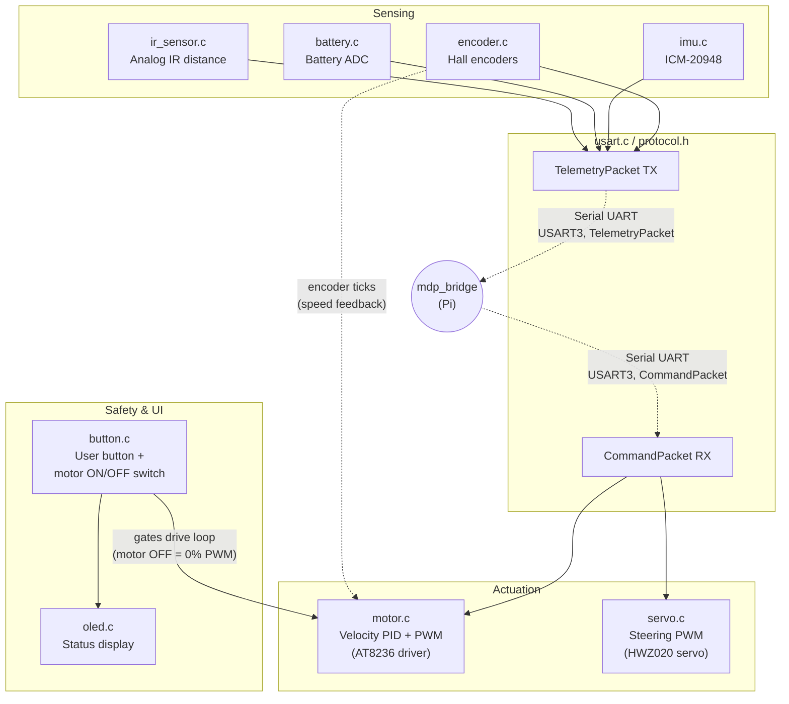
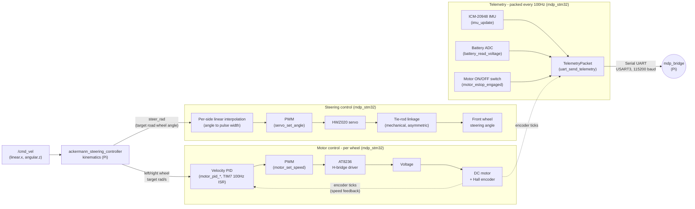

# STM32 (`mdp_stm32`)

PlatformIO/STM32Cube HAL firmware for the WHEELTEC C30D V2.1 board (STM32F407VET6 MCU) — one
physical device, one submodule. Pure hardware I/O controller — all kinematics live on the RPi host.
It receives wheel speed and steering commands over a fixed-size binary serial protocol (USART3 @
115200 baud on `PD8`/`PD9`) and publishes raw encoder telemetry back to the Raspberry Pi 4B host.

## STM32 System Overview

Expanding the "STM32" box from the [System Overview](../index.md) diagram — the driver modules
behind the serial link, grouped by what they do:


<p align="center"><strong>Fig. 1</strong> — STM32 System Overview</p>

## Architecture & Design Decisions

- **No RTOS** — bare-metal HAL. Timing is hand-coordinated via NVIC interrupt priorities + shared
  `volatile` globals, not scheduler tasks.
- **Priority rule**: the actuator-driving loop (motor PID, `TIM7`) always gets the highest priority
  in the system.
- **Two main-loop rate tiers**: fast (100Hz — command/safety/IMU/telemetry) and slow (~5Hz —
  OLED/battery/debug), not one shared 10Hz loop.
- **Closed-loop wheel-speed PID runs on the STM32**, not the Pi/EKF — only place with low-latency
  access to both PWM timers and encoder counters in the same cycle.
- **Custom binary protocol over `USART3`** — see [Serial Protocol](serial_protocol.md).

## Folder & File Hierarchy

```text
mdp_stm32/
├── platformio.ini            # Board/toolchain config, build flags
├── include/                  # Headers - one per driver
│   ├── motor.h, servo.h, encoder.h, imu.h, battery.h, button.h, oled.h
│   ├── usart.h, protocol.h   # Serial link to mdp_ros
│   └── selftest.h
└── src/                      # Implementation - one .c per driver, matches include/
    ├── main.c                # Boot sequence + main loop (fast/slow rate tiers)
    ├── motor.c, servo.c, encoder.c, imu.c, battery.c, button.c, oled.c
    ├── usart.c                # Binary protocol framing/TX/RX
    └── selftest.c             # Scripted drive/steer self-test
```

## Learn More

| Topic | What it covers |
| --- | --- |
| [**Firmware Architecture**](architecture.md) | Interrupt/timing design, driver internals, pin allocations. |
| [**Control Tuning & Calibration**](tuning.md) | Closed-loop wheel-speed PID theory, servo range/steering calibration, IMU → EKF data flow. |
| [**Serial Protocol**](serial_protocol.md) | Binary framing, telemetry/command packet layout, stale-link fail-safe. |

---

## Overview: motor, servo & telemetry flow

Two driven wheels use 100 Hz wheel-speed PI control with feedforward. The steering servo uses
[calibrated per-side linear interpolation](tuning.md#servo-range-steering-calibration).
Telemetry includes encoder counts, IMU readings, cached battery voltage and IR readings, and motor-switch state.


<p align="center"><strong>Fig. 2</strong> — Motor, Servo & Telemetry Flow</p>

!!! note "Ackermann-only: 2 motors, 1 servo"
    This project only uses motors A/B + one steering servo — no C/D motors or omni/mecanum paths.

!!! warning "PID not yet bench-tested — see [TODO](#todo)"
    Untuned placeholder gains, never run on hardware. Test/tune this before building anything else
    on top of it — see [Bench-Tuning the Motor PID](#bench-tuning-the-motor-pid) below.

---

## TODO

- [x] Bringup (LED/printf) — verified on hardware
- [x] AT8236 motor PWM — verified on hardware; locked-antiphase drive required, see [AT8236 Motor Driver](architecture.md#at8236-motor-driver-motorc)
- [x] HWZ020 steering servo — calibrated on hardware in **real wheel angle**: center `1490µs`, left `+35.0°` @ `840µs`, right `−29.5°` @ `2400µs`. WHEELTEC's cubic retired in favour of per-side linear interpolation between measured endpoints. See [Servo Range & Steering Calibration](tuning.md#servo-range-steering-calibration)
- [x] URDF steering limits — now asymmetric `lower="-0.5149" upper="0.6109"` (−29.5°/+35.0°), from protractor readings; not yet re-validated on hardware. Replaces a symmetric `±0.5672 rad` (32.5°) whose stated measurement was never performed, see [What the earlier record got wrong](tuning.md#what-the-earlier-record-got-wrong)
- [ ] Steering — **which wheel** each protractor reading came from was not recorded, so `left_joint`/`right_joint` still share one limit pair when Ackermann geometry says they should differ. Right limit (`2400µs`) also unconfirmed — the wheel was still tracking there. See [Still open](tuning.md#still-open)
- [ ] Closed-loop wheel-speed PID — implemented, **not bench-tuned or hardware-tested**. `MOTOR_PID_KP=4.0f`/`KI=0.5f` are untuned placeholders. **Next priority** — see [Bench-Tuning the Motor PID](#bench-tuning-the-motor-pid)
- [x] `PD3` motor switch gating — implemented, functionally confirmed; polarity not yet cross-checked with a multimeter
- [x] NVIC interrupt priorities — verified on hardware; motor PID (`TIM7`) now highest-priority, see [Interrupt / Timing Architecture](architecture.md#interrupt-timing-architecture)
- [ ] Main loop rate tiers (100Hz/5Hz) — implemented, not yet hardware-tested, see [Main loop timing allocation](architecture.md#main-loop-timing-allocation)
- [x] Hall encoder driver + ticks/rev — verified on hardware; 1560 ticks/rev confirmed both wheels, see [Ticks-per-revolution](architecture.md#ticks-per-revolution-physically-confirmed-on-hardware). Wheel diameter/rolling radius for ticks→distance still unconfirmed
- [x] ICM-20948 IMU driver — implemented
- [x] Serial protocol + `mdp_bridge` — full round-trip verified on hardware (`pixi run real` + `pixi run teleop`), see [Serial Protocol](serial_protocol.md#serial-protocol)
- [x] Battery voltage ADC — implemented; divider ratio (11x) from vendor firmware, not cross-checked with a multimeter
- [x] Automated self-test (`selftest.c`) — verified on hardware
- [ ] Ultrasonic (HC-SR04) driver — not started
- [x] IR distance sensor (Sharp GP2Y0A21YK) driver - completed for one channel on PC2/ADC1_CH12, with raw ADC, voltage, and estimated distance on OLED. Two-channel integration is not present in this checkout.

---

See [Quickstart](../quickstart.md) for every `pixi run` command (setup, flash, monitor, teleop) —
this page stays theory-only from here on.

## Bench-Tuning the Motor PID

Do this before anything else builds on top of the wheel PID — see
[Control Tuning: Closed-Loop Wheel Speed Control](tuning.md#closed-loop-wheel-speed-control) for why
it's designed this way.

1. Flash (`pixi run flash`), get the robot up on blocks so the wheels spin free.
2. Send a step target via ROS (`ros2 topic pub /joint_commands ...` with a fixed `velocity` for
   `lb_joint`/`rb_joint`) or a temporary direct test in firmware — watch actual wheel behavior.
3. Start from `MOTOR_PID_KI = 0` (pure P + feedforward). Raise `MOTOR_PID_KP` until the wheel
   tracks a step target quickly with acceptable overshoot (a little overshoot then settle is fine;
   visible oscillation/buzzing means back off).
4. Reintroduce `MOTOR_PID_KI` in small steps, just enough to kill any remaining steady-state error
   (commanded rad/s vs. `motor_pid_get_measured_rad_s()`'s reading not converging) — too much causes
   slow oscillation/overshoot growing over time.
5. Repeat for both wheels — since they're never perfectly matched, it's plausible (though not
   certain) the same gains work fine for both; watch for one wheel behaving worse than the other,
   which would call for asymmetric tuning instead of a shared `MOTOR_PID_KP`/`MOTOR_PID_KI`.
6. Once tuned on blocks, re-verify on the ground with the actual chassis weight/friction before
   trusting it for real runs — this is a meaningfully different load than free-spinning wheels.

If, after tuning, the car still curves during a straight `/cmd_vel` command, see
[Control Tuning: Wheel-speed trim](tuning.md#wheel-speed-trim).

---

## Verification Checklist (post-flash bring-up)

!!! note "Separate debug and protocol UARTs"
    Debug `printf` output uses USART1 (USB Port 1); the Raspberry Pi binary protocol uses
    USART3 (USB Port 3). Connect the serial monitor to USART1 for the boot banner and debug output.

**No host needed:**

1. `pixi run flash` then `pixi run monitor` — confirm the boot banner prints, PE8 LED blinks, OLED cycles pages via the button.
2. **Encoders:** spin a rear wheel by hand, watch OLED page 3 (`Enc L`/`Enc R`) — counts should change and sign should flip with direction.
3. **Motor switch (`PD3`):** toggle it, watch OLED page 3's `ESTOP` field flip READY/ENGAGED. Polarity is an *assumption*, not yet physically verified — if it reads backwards, flip the comparison in `motor_estop_engaged()` (`motor.c`).
4. **Servo:** should visibly center on boot. Real steering needs a host command (see below).
5. **Motors (normal operation):** remain stopped without an active host link; the self-test below is an exception — `uart_command_is_stale()` forces `motor_set_speed(0, 0)` within 500ms of boot if no command has ever arrived. This is the fail-safe working as intended, not a problem.

**Straight-line PI self-test (no host needed):** The self-test centers steering and runs a timed straight-line PI test. PE8 blinks once to start, twice when done, or five times if PD3 disables motors. Other tests are commented out.
Implemented in `mdp_stm32/src/selftest.c` (`selftest_run_if_requested()`).

`PE0` (the user button) is dual-purpose, depending on *when* you press it and, during normal
operation, the state of the `PD3` motor ON/OFF switch:

| When you press it | `PD3` state | What happens |
| --- | --- | --- |
| Held through reset/power-on | Motor ON (ready) | Runs self-test before the main loop |
| Held through reset/power-on | Motor OFF (disabled) | Refuses self-test, then enters the main loop |
| Board already running normally | Motor ON (ready) | Runs the self-test sequence (can actually drive the motors) |
| Board already running normally | Motor OFF (disabled) | Cycles the OLED page instead (self-test would just refuse anyway) |

To trigger at boot, hold PE0 through reset with the PD3 motor switch enabled until the self-test starts.
The OLED displays test status. Steering calibration routines are disabled by default; see
[Calibration tooling](tuning.md#calibration-tooling) for details.

!!! warning "Bridge telemetry layout needs updating"
    The IR firmware sends 64-byte telemetry; the checked-out bridge expects 54 bytes.
    Resolve the [packet mismatch](serial_protocol.md) before running the bridge verification below.

**With the ROS2 bridge running** (wheels off the ground first):

```bash
# find which /dev/ttyUSBx is USART3 - unplug/replug and check dmesg, or just try one
ros2 run mdp_bridge serial_bridge_node --ros-args -p serial_port:=/dev/ttyUSB0

# in other terminals:
ros2 topic echo /joint_states   # live encoder-derived position/velocity
ros2 topic echo /imu/data       # live accel/gyro
ros2 topic echo /estop          # should match the PD3 switch state

ros2 topic pub /joint_commands sensor_msgs/msg/JointState \
  "{name: ['lb_joint','rb_joint','left_joint','right_joint'], velocity: [2.0,2.0], position: [0.2,0.2]}" --once
```
Wheels should spin slowly and the servo should turn — confirms the full STM32 -> Pi -> STM32 loop.
