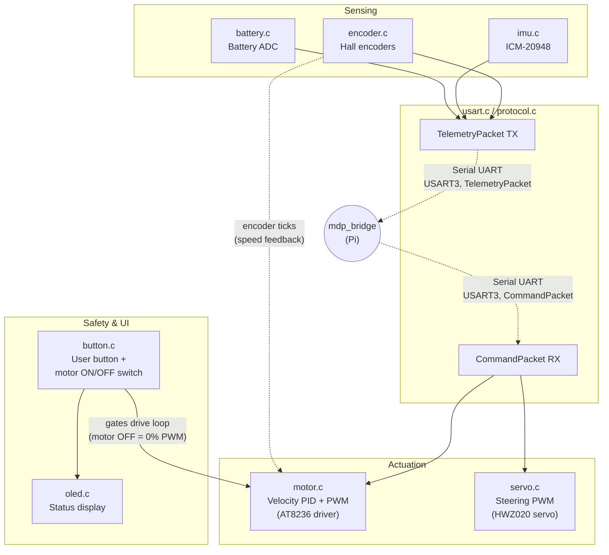
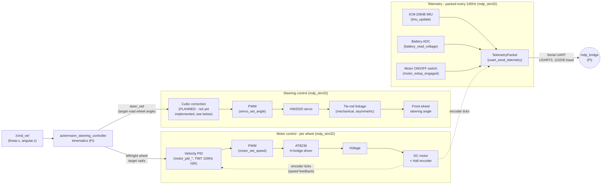

# STM32 (`mdp_stm32`)

PlatformIO/STM32Cube HAL firmware for the WHEELTEC C30D V2.1 board (STM32F407VET6 MCU) — one
physical device, one submodule. Pure hardware I/O controller — all kinematics live on the RPi host.
It receives wheel speed and steering commands over a fixed-size binary serial protocol (USART3 @
115200 baud on `PD8`/`PD9`) and publishes raw encoder telemetry back to the Raspberry Pi 4B host.

## STM32 System Overview

Expanding the "STM32" box from the [System Overview](../index.md) diagram — the driver modules
behind the serial link, grouped by what they do:


<p align="center"><strong>Fig. 1</strong> — STM32 System Overview</p>

## Folder & File Hierarchy

```text
mdp_stm32/
├── platformio.ini            # Board/toolchain config, build flags
├── include/                  # Headers - one per driver
│   ├── motor.h, servo.h, encoder.h, imu.h, battery.h, button.h, oled.h
│   ├── usart.h, protocol.h   # Serial link to mdp_ros
│   └── selftest.h
└── src/                      # Implementation - one .c per driver, matches include/
    ├── main.c                # Boot sequence + main loop (fast/slow rate tiers)
    ├── motor.c, servo.c, encoder.c, imu.c, battery.c, button.c, oled.c
    ├── usart.c                # Binary protocol framing/TX/RX
    └── selftest.c             # Scripted drive/steer self-test
```

## Pages

- [**Firmware Architecture**](architecture.md) — Interrupt/timing design, driver internals, pin allocations.
- [**Control Tuning & Calibration**](tuning.md) — Closed-loop wheel-speed PID theory, servo range/steering calibration, IMU → EKF data flow.
- [**Serial Protocol**](serial_protocol.md) — Binary framing, telemetry/command packet layout, stale-link fail-safe.

---

## Overview: motor, servo & telemetry flow

Command path is the same shape as WHEELTEC's own motor-control flow diagram (`STM32运动底盘开发手册`,
图 6-4), adapted to this project's actual hardware — 2 driven wheels (A=left, B=right, matching the
diagram's note that Ackermann chassis only use motors A/B) and 1 steering servo, with the servo
path's cubic correction stage marked as planned (see
[Servo Range & Steering Calibration](tuning.md#servo-range-steering-calibration)) since it isn't
implemented yet. The telemetry path back to the Pi isn't just encoder feedback — every 100Hz tick
also packs in IMU, battery voltage, and the motor ON/OFF switch state (see
[Interrupt / Timing Architecture](architecture.md#interrupt-timing-architecture)):


<p align="center"><strong>Fig. 2</strong> — Motor, Servo & Telemetry Flow</p>

!!! note "Only 2 motors, 1 servo - no C/D motors or omni/mecanum paths"
    WHEELTEC's own diagram (图 6-4) covers up to 4 drive motors for their omni/mecanum chassis
    variants, with a note that differential and Ackermann chassis only use motors A/B and the X/Z
    target axes. This project is Ackermann-only, so that's the only row that applies here.

!!! warning "Status: implemented, NOT yet bench-tested — test/tune this before anything else"
    The closed-loop wheel PID (see [Control Tuning & Calibration](tuning.md#closed-loop-wheel-speed-control))
    is **implemented** in `mdp_stm32` (`motor_pid_init` /
    `motor_pid_enable` / `motor_pid_set_target` / `motor_pid_get_measured_rad_s` / `motor_pid_pause`
    / `motor_pid_resume` in `motor.c`, wired into `main.c` and `selftest.c`) but has **never run on
    physical hardware** — `MOTOR_PID_KP=4.0f`/`MOTOR_PID_KI=0.5f` are untuned placeholder guesses.
    **Next action: flash it and bench-tune with the wheels off the ground before building anything
    else on top of it** — see [Bench-Tuning the Motor PID](#bench-tuning-the-motor-pid) below.
    Servo range and IMU → EKF flow (config already applied in `ekf.yaml`) are otherwise unaffected
    and can be done independently, but PID tuning is the priority right now.

    Cross-referenced against WHEELTEC's own C30D vendor firmware
    (`references/WHEELTEC/.../R550_C30D(2.0)_..._霍尔编码器_2025.12.26.zip`) to ground the control-law
    shape in a working reference implementation for this exact board/motor/encoder combo — gain
    *values* were not transferable (different PWM/tick scale), only the incremental-PI structure.

---

## Bench-Tuning the Motor PID

!!! warning "Do this before anything else builds on top of it"
    The closed-loop wheel PID is implemented but has never run on physical hardware —
    `MOTOR_PID_KP=4.0f`/`MOTOR_PID_KI=0.5f` are untuned placeholder guesses. See
    [Control Tuning: Closed-Loop Wheel Speed Control](tuning.md#closed-loop-wheel-speed-control)
    for why it's designed this way.

1. Flash (`pixi run flash`), get the robot up on blocks so the wheels spin free.
2. Send a step target via ROS (`ros2 topic pub /joint_commands ...` with a fixed `velocity` for
   `lb_joint`/`rb_joint`) or a temporary direct test in firmware — watch actual wheel behavior.
3. Start from `MOTOR_PID_KI = 0` (pure P + feedforward). Raise `MOTOR_PID_KP` until the wheel
   tracks a step target quickly with acceptable overshoot (a little overshoot then settle is fine;
   visible oscillation/buzzing means back off).
4. Reintroduce `MOTOR_PID_KI` in small steps, just enough to kill any remaining steady-state error
   (commanded rad/s vs. `motor_pid_get_measured_rad_s()`'s reading not converging) — too much causes
   slow oscillation/overshoot growing over time.
5. Repeat for both wheels — since they're never perfectly matched, it's plausible (though not
   certain) the same gains work fine for both; watch for one wheel behaving worse than the other,
   which would call for asymmetric tuning instead of a shared `MOTOR_PID_KP`/`MOTOR_PID_KI`.
6. Once tuned on blocks, re-verify on the ground with the actual chassis weight/friction before
   trusting it for real runs — this is a meaningfully different load than free-spinning wheels.

If, after tuning, the car still curves during a straight `/cmd_vel` command, see
[Control Tuning: Wheel-speed trim](tuning.md#wheel-speed-trim-a-tool-to-reach-for-if-one-wheel-is-no-good-after-pid-tuning).

---

## Verification Checklist (post-flash bring-up)

!!! note "`printf` debug text and the binary protocol share `USART3`"
    Since the protocol went in, `pixi run monitor` shows readable boot-banner/telemetry-line text interleaved with raw binary garbage from the packet stream — expected, not a bug. The framed protocol resyncs on sync bytes and rejects bad checksums regardless.

**No host needed:**

1. `pixi run flash` then `pixi run monitor` — confirm the boot banner prints (amid binary noise), PE8 LED blinks, OLED cycles pages via the button.
2. **Encoders:** spin a rear wheel by hand, watch OLED page 3 (`Enc L`/`Enc R`) — counts should change and sign should flip with direction.
3. **Motor switch (`PD3`):** toggle it, watch OLED page 3's `ESTOP` field flip READY/ENGAGED. Polarity is an *assumption*, not yet physically verified — if it reads backwards, flip the comparison in `motor_estop_engaged()` (`motor.c`).
4. **Servo:** should visibly center on boot. Real steering needs a host command (see below).
5. **Motors:** will **not** spin at all without an active host link — `uart_command_is_stale()` forces `motor_set_speed(0, 0)` within 500ms of boot if no command has ever arrived. This is the fail-safe working as intended, not a problem.

**Automated drive/steer self-test (no host needed):** runs a scripted sequence — forward 1 wheel revolution, backward 1 wheel revolution, steer left, steer right, return to center. Implemented in `mdp_stm32/src/selftest.c` (`selftest_run_if_requested()`).

`PE0` (the user button) is dual-purpose, depending on *when* you press it and, during normal
operation, the state of the `PD3` motor ON/OFF switch:

| When you press it | `PD3` state | What happens |
| --- | --- | --- |
| Held down at the exact moment the board resets/powers on | either | Skips normal startup, runs the self-test instead |
| Board already running normally | Motor ON (ready) | Runs the self-test sequence (can actually drive the motors) |
| Board already running normally | Motor OFF (disabled) | Cycles the OLED page instead (self-test would just refuse anyway) |

`selftest_run_if_requested()` checks the pin's level **once**, right after peripheral init and
*before* the main loop starts — it is not watching for a long-press while the firmware is already
running. To trigger it: hold `PE0` down, power-cycle (or hit physical reset) *while still holding
it*, and keep holding for a second or two after power returns — you'll see the LED start its
1-2-3-4-5-6 blink pattern once the sequence begins, at which point you can let go. Refuses to run
if the `PD3` motor switch is in the OFF (disabled) position.

Only `PE8` is a GPIO-controllable LED on this board (confirmed against the resource-allocation PDF — the `LED1`-`LED4` silkscreen labels on the schematic are hardwired power-rail/SWD indicators, not firmware-drivable). So each phase blinks `PE8` a distinct number of times instead of lighting separate LEDs:

| Blinks | Phase |
| --- | --- |
| 1 | Forward, 1 wheel revolution |
| 2 | Backward, 1 wheel revolution |
| 3 | Full-range servo sweep, **left limit first**, then slowly ascending to the right limit (confirmed asymmetric: left 27°, right 41°) — see [Control Tuning: Servo Range & Steering Calibration](tuning.md#servo-range-steering-calibration). Supersedes the old fixed ±20° steer-left/steer-right phases, which were dropped |
| 4 | Done |

Refusal (motor switch OFF) is a *separate* standalone 5-blink pattern with different timing
(100ms on/off vs. the phases' 150ms on/off) — not part of the numbered sequence above, so it can't
be confused with any of these phase counts.

The OLED also prints the current phase. Each drive phase has a 5s safety timeout (`SELFTEST_DRIVE_TIMEOUT_MS`) in case the wheels aren't actually turning (e.g. propped up wrong, or a real motor/encoder fault) — it won't hang forever waiting for encoder ticks that never arrive.

**With the ROS2 bridge running** (wheels off the ground first):

```bash
# find which /dev/ttyUSBx is USART3 - unplug/replug and check dmesg, or just try one
ros2 run mdp_bridge serial_bridge_node --ros-args -p serial_port:=/dev/ttyUSB0

# in other terminals:
ros2 topic echo /joint_states   # live encoder-derived position/velocity
ros2 topic echo /imu/data       # live accel/gyro
ros2 topic echo /estop          # should match the PD3 switch state

ros2 topic pub /joint_commands sensor_msgs/msg/JointState \
  "{name: ['lb_joint','rb_joint','left_joint','right_joint'], velocity: [2.0,2.0,0,0], position: [0,0,0.2,0.2]}" --once
```
Wheels should spin slowly and the servo should turn — confirms the full STM32 -> Pi -> STM32 loop.

---

## Verified / Not Yet Verified On Hardware

**Verified:**

- STM32-side firmware builds (`pixi run build`) and flashes (`pixi run flash`) cleanly.
- `PD3` motor switch polarity assumption — functionally confirmed (self-test correctly refuses with the quick 5-blink pattern when the switch is in the disabled position, runs normally otherwise). Not yet confirmed with a multimeter against the raw pin voltage.
- Full protocol round-trip (`ackermann_steering_controller` → `topic_based_ros2_control` → `mdp_bridge` → STM32 → motors/servo, and telemetry back) — confirmed via `pixi run real` + `pixi run teleop`, after fixing two bugs found along the way: the `/joint_commands` array-indexing bug and the steering sign-convention mismatch.
- The automated self-test sequence (`selftest.c`) — confirmed running on physical hardware, including actual wheel rotation, after fixing the motor driver's PWM scheme (see [Firmware Architecture: AT8236 Motor Driver](architecture.md#at8236-motor-driver-motorc)).
- Steering servo range — calibrated on physical hardware at 1° resolution per side (see [Control Tuning: Servo Range & Steering Calibration](tuning.md#servo-range-steering-calibration)).
- Hall encoder ticks-per-revolution (1560) — physically confirmed on both wheels via a 10-rotation hand-turn test (see [Firmware Architecture: Ticks-per-revolution](architecture.md#ticks-per-revolution-physically-confirmed-on-hardware)).

**Not yet verified:**

- Closed-loop wheel-speed PID — implemented, not bench-tuned or hardware-tested (see [Bench-Tuning the Motor PID](#bench-tuning-the-motor-pid) above).
- `PD3` motor switch polarity has not been confirmed with a multimeter against the raw pin voltage (only functionally, via self-test behavior).
- Battery voltage ADC divider ratio (11x) — sourced from WHEELTEC's vendor example firmware, not cross-checked against a multimeter on this specific board.
- Wheel diameter / effective rolling radius for ticks→real-distance conversion — unconfirmed.

---

## TODO

- [x] PlatformIO/STM32Cube HAL Project Bringup — LED blink (`PE8`) + `printf` serial logging over `USART3`, verified on physical board
- [x] AT8236 Motor PWM Driver — `TIM9`/`TIM10`/`TIM11` PWM implemented (`motor_init`, `motor_set_speed`); **on-hardware drive test confirmed** (locked-antiphase drive scheme required, see [Firmware Architecture](architecture.md#at8236-motor-driver-motorc))
- [x] HWZ020 Steering Servo Driver (`PB15` / TIM12_CH2) — Implemented (`servo_init`, `servo_set_angle`); on-hardware steering confirmed via ROS2 teleop; **mechanical steering-lock commanded values calibrated at 1° resolution: right 41°, left 27°** (firmware-internal pulse-mapped unit, not real angle) — see [Control Tuning](tuning.md#servo-range-steering-calibration)
- [x] URDF `left_joint`/`right_joint` limits updated to `±0.5672 rad` (32.5°) — the **steering angle** physically measured with a protractor, 8 raw readings across 2 measurement sessions (both wheels, both firmware-clamped commanded extremes). Mode at 0.5° resolution (32.5°, agreed on by 3 of 8 readings, confirmed independently via right-wheel-only readings too) taken as the answer over the mean — see [Control Tuning](tuning.md#resolved-urdf-steering-limit-now-matches-the-real-measured-steering-angle). Replaces the servo's bare datasheet spec (`±0.39 rad`/22.35°). Not yet re-validated on hardware after the change
- [ ] Closed-Loop Wheel Speed PID — **Implemented, NOT yet bench-tuned or hardware-tested** (`motor_pid_init/enable/set_target/get_measured_rad_s/pause/resume` in `motor.c`, TIM7 100Hz ISR, hybrid feedforward+incremental-PI). `MOTOR_PID_KP=4.0f`/`MOTOR_PID_KI=0.5f` are untuned placeholder gains. **This is the next priority item** — flash and bench-test (wheels off the ground) before any other `mdp_stm32` work builds on top of it. See [Bench-Tuning the Motor PID](#bench-tuning-the-motor-pid)
- [x] Motor switch (`PD3`) now gates the driving loop directly in `main.c` (not just self-test) — switch OFF forces 0% PWM regardless of host commands; not yet hardware-tested
- [x] NVIC interrupt priorities reordered — motor PID (`TIM7`) is now the highest-priority app interrupt (was previously *lowest*, an oversight that let the button/UART preempt the safety-critical motor loop); see the ownership table in [Firmware Architecture: Interrupt / Timing Architecture](architecture.md#interrupt-timing-architecture)
- [x] Main loop split into two rate tiers (100Hz command/IMU/telemetry, ~5Hz OLED/battery/debug) instead of one shared 10Hz `HAL_Delay` — telemetry TX converted to interrupt-driven (`HAL_UART_Transmit_IT`) to make 100Hz viable; not yet hardware-tested. See [Firmware Architecture: Main loop timing allocation](architecture.md#main-loop-timing-allocation)
- [x] Hall Encoder Driver (TIM2 / TIM3) — Implemented (`encoder_init`, delta + cumulative tick reads). **Ticks-per-revolution (1560) physically confirmed on hardware** for both wheels via a 10-rotation hand-turn test (average landed on exactly 1560.0 ticks/rev, both sides, no systematic left/right discrepancy) — see [Firmware Architecture](architecture.md#ticks-per-revolution-physically-confirmed-on-hardware). Wheel diameter/effective rolling radius for ticks→real-distance conversion is still unconfirmed
- [x] ICM-20948 IMU Driver (bit-banged software I2C, `PB10`/`PB11`) — Implemented
- [x] Onboard Motor ON/OFF Switch (`PD3`) — Implemented (`motor_estop_engaged`); active-low polarity functionally confirmed via self-test refusal behavior, not yet confirmed with a multimeter
- [x] Serial Protocol + `mdp_bridge` — Custom binary protocol over `USART3` implemented on both sides (see [Serial Protocol](serial_protocol.md#serial-protocol)); replaces the originally planned micro-ROS transport; **full round-trip on-hardware validated** via `pixi run real` + `pixi run teleop` (two bugs found and fixed along the way — see [RPi: ROS2 Jazzy](../rpi/ros2_jazzy.md#core-topic-specifications))
- [x] Battery Voltage ADC (`PB0` / ADC1_CH8) — Implemented (`battery_init`, `battery_read_voltage`); divider ratio (11x) sourced from WHEELTEC's C30D vendor example firmware, not yet cross-checked against a multimeter on this specific board
- [ ] Ultrasonic Distance Sensor (HC-SR04) Driver — Not started
- [ ] IR Distance Sensor (Sharp GP2Y0A21YK ×2) Driver — Not started

