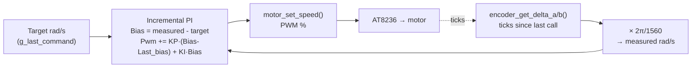

# Control Tuning & Calibration (`mdp_stm32`)

Closed-loop wheel-speed PID theory, servo range/steering calibration, and the IMU → `ros2_control`
→ `robot_localization` data flow. For hands-on bench-tuning steps, see
[Overview: Bench-Tuning the Motor PID](index.md#bench-tuning-the-motor-pid).

---

## Closed-Loop Wheel Speed Control

A dedicated `TIM7` ISR runs at 100Hz and closes the loop per wheel:


<p align="center"><strong>Fig. 3</strong> — Wheel-Speed PID Loop (per wheel)</p>

Incremental PI (accumulates `Pwm` from `Bias` deltas) rather than a positional PID — naturally
rate-limits output changes, which matters for not stalling the AT8236's gate drive (see the
locked-antiphase note in [AT8236 Motor Driver](architecture.md#at8236-motor-driver-motorc)).

The safety layers wrap the loop and always win: the 500ms stale-command fail-safe
(`uart_command_is_stale`) and the `PD3` motor switch check zero the PWM output unconditionally,
ahead of/around the PID — the PID can never override those.

`MOTOR_PID_KP=4.0f`/`MOTOR_PID_KI=0.5f` are untuned placeholder gains — see
[Bench-Tuning the Motor PID](index.md#bench-tuning-the-motor-pid) for the tuning procedure.

**Limitation**: matching each wheel's own encoder-measured rad/s doesn't guarantee equal *real*
ground speed — different effective wheel radius/tire wear/alignment is invisible to the encoder.
A perfectly-tuned PID can still leave the car curving on a straight command — see
[Wheel-speed trim](#wheel-speed-trim) below.

### Wheel-speed trim

Not implemented — only add if the car still visibly curves on a straight `/cmd_vel` command *after*
the PID is bench-tuned and each wheel is confirmed tracking its own target correctly. If it drives
straight once tuned, skip this.

If needed: two constants, `MOTOR_LEFT_TRIM`/`MOTOR_RIGHT_TRIM` (default `1.0f`, neutral), applied to
`left_rad_s`/`right_rad_s` before `motor_pid_set_target()` — adjusts what the PID is asked to track,
not the PID itself. Tuned by feel: drive straight, see which way it curves, nudge the trim on the
lagging side, repeat.

---

## Servo Range & Steering Calibration

**The problem**: the servo-command-to-real-wheel-angle relationship isn't linear, and isn't symmetric
between left and right — one side needs 27° commanded, the other 41°, to reach the same ~32.5° real
wheel angle. This is a property of any rigid-linkage Ackermann steering mechanism (confirmed against
WHEELTEC's own kinematics manual — no such linkage can hold a constant ratio across its full range),
not a defect specific to this chassis.

**The real fix**: fit a cubic curve per side from measured (servo angle, real angle) data, instead of
assuming a linear gain. This is the same fix WHEELTEC uses on boards without a linkage feedback
sensor (open-loop PWM only, same as this project).

:white_check_mark: **Implemented (2026-09-03)**, adapted directly from WHEELTEC's own reference
firmware (`R550_C30D(2.0)` chassis source, `BALANCE/balance.c`, `Drive_Motor()`'s `Akm_Car` branch)
rather than fitting our own from scratch:

```c
Angle_Servo = -0.628*angle^3 + 1.269*angle^2 - 1.772*angle + 1.573;
Servo_us    = 1500 + (Angle_Servo - 1.572) * 636.56;   // clamped to 800-2200us
```

Reasoning for adopting their coefficients directly instead of re-deriving our own: the underlying
nonlinearity is a property of the physical rigid-linkage Ackermann mechanism itself (see "The
problem" above — no such linkage holds a constant ratio across its range), not something specific
to their sample unit, so the curve *shape* was expected to transfer.

**Hardware-tested (2026-09-03)**, confirmed against the actual chassis:
- Sign convention matches ours (positive angle = wheel turns right, negative = left) — no flip.
- Their clamp bounds (`-28.1°` left / `+18.3°` right, non-symmetric) do **not** transfer as-is:
  `-28.1°` lands close to this unit's real left lock, but `+18.3°` is confirmed conservative — this
  unit's real right-side lock is further out than that. Expected per-unit variance (servo trim +
  linkage assembly tolerance), consistent with the old linear clamps (41°/27°) also being
  unit-specific rather than a spec value.

**Current status**: `SERVO_ANGLE_MAX_LEFT_RAD`/`SERVO_ANGLE_MAX_RIGHT_RAD` (`servo.h`) are set to
WHEELTEC's `28.1°`/`18.3°` bounds as a **provisional, safe-to-drive-on clamp** — not yet the
accurate real-lock values, and confirmed leaving real range unused on the right side. **Not yet
prioritized for refinement** — deferred behind bench-tuning the wheel-speed PID (see
[Bench-Tuning the Motor PID](index.md#bench-tuning-the-motor-pid)), then full-pipeline
(host↔MCU) verification.

**Next calibration step (when revisited)**: fine-sweep the right side past `18.3°` (tooling already
exists: `selftest.c`'s `servo_sweep_right_fine()`, currently unwired into `selftest_run()`, sweeps
`35-55°` commanded via `servo_set_angle_raw()`) to find this unit's real right-side lock, then
decide whether to keep WHEELTEC's coefficients with a widened right clamp, or refit our own cubic
per side from measured (commanded angle, real wheel angle) data per the original plan below.

Procedure for the physical measurement side (no special tools beyond a protractor / phone protractor
app):

1. Servo centers at boot (1500 µs / 0°) — confirm visually first.
2. Command a small angle via ROS (`ros2 topic pub /joint_commands ...` with a small `position`) and
   step outward in ~5° increments toward the current `SERVO_ANGLE_MAX_LEFT/RIGHT_RAD` limit.
3. Watch/listen at each step: a servo pushed past its mechanical lock either **stalls with an
   audible buzz/whine** (current spike, no visible motion) or the **steering knuckle binds/scrapes**
   against the chassis/wheel well before the servo horn itself stops turning.
4. The last angle with clean, unobstructed motion is the real max — set `SERVO_ANGLE_MAX_LEFT/RIGHT_RAD` a
   couple degrees under that, not exactly at it (stalling a servo repeatedly wears it out).
5. Check **both** left and right separately — Ackermann knuckles aren't always symmetric, so don't
   assume the ± range is equal.

:white_check_mark: Calibrated on hardware via degree-by-degree sweeps per side. Final operating
limits (commanded unit, stored in radians per REP-103 to match the rest of the stack):

| Side | `servo.h` constant | Value |
| --- | --- | --- |
| Right | `SERVO_ANGLE_MAX_RIGHT_RAD` | **41°** (~0.7156 rad) |
| Left | `SERVO_ANGLE_MAX_LEFT_RAD` | **27°** (~0.4712 rad) |

Genuinely asymmetric, not a rough estimate — Ackermann knuckles aren't guaranteed symmetric.
`selftest.c`'s `servo_sweep_range()` sweeps either direction, and `servo_set_angle_raw()` bypasses
the operating clamp for calibration probing.

The `HWZ020`'s datasheet-rated range is ±22.35° — smaller than the operating value above, because
the datasheet describes the servo's own internal travel, not the actual wheel steering angle this
chassis's linkage achieves. The chassis-measured value is what governs safe operation here.

**Implementation** (`servo.h`/`servo.c`): `servo_set_angle(float angle_rad)` clamps asymmetrically
(`+SERVO_ANGLE_MAX_RIGHT_RAD` / `-SERVO_ANGLE_MAX_LEFT_RAD`) while keeping one fixed
`SERVO_ANGLE_SCALE_RAD` (~0.7854 rad / 45°) for the radians→microseconds conversion — pulse-per-radian
rate is identical both sides, only the clamp differs. `SERVO_PULSE_MIN_US`/`MAX_US` (600/2400µs) is
the widened range the clamps were validated against — don't revert it to stock.

### Command resolution — how finely the steering angle can actually be set

The smallest angular increment the firmware can command is set by the PWM timer's tick size, not by
either side's clamp:

- `TIM12`'s compare register only accepts whole microseconds (`PSC=83` on the 84MHz `TIM12CLK` gives
  exactly a 1MHz/1µs-tick counter) — the pulse width can't change by anything finer than 1µs.
- The pulse-to-angle rate is fixed and shared by both sides (`SERVO_ANGLE_SCALE_RAD`): 900µs of pulse
  span maps to 45°.
- **1µs = 45°/900 = exactly 0.05° (~0.000873 rad)** — the finest angular step the firmware can
  command, identical on both the left and right side, since it comes from the timer resolution and
  the shared conversion rate, not from either side's clamp value.

In terms of addressable positions across each side's full range: left (27°) has ~540 positions
(27/0.05), right (41°) has ~820 (41/0.05) — different *counts* purely because the ranges are
different sizes, but the *step size* between any two adjacent positions is the same 0.05° on both
sides. (This is separate from the servo's own internal potentiometer/gear resolution, which isn't
documented for the `HWZ020` — 0.05° is the ceiling the *firmware* can address, the servo itself could
plausibly be coarser, but not finer than what a 1µs pulse change can express.)

### Raw PWM pulse range and real-world angular precision

Everything above is in the *commanded* pulse-mapped unit. Now that the real steering angle achieved
at each commanded extreme is known (32.5° at both, from the mode analysis below), the actual raw
signal the servo receives, and the real-world precision that maps to, can be stated directly.

**Raw pulse width range actually used during normal operation** (`servo_set_angle()`, clamped to
`SERVO_ANGLE_MAX_LEFT/RIGHT_RAD` = 27°/41° commanded):

| | Commanded (invented unit) | Raw PWM pulse width |
| --- | --- | --- |
| Center | 0° | **1500µs** |
| Left limit | -27° | **960µs** (`1500 - 27/45 × 900`) |
| Right limit | +41° | **2320µs** (`1500 + 41/45 × 900`) |

So in operation the servo is driven across **960µs to 2320µs**, not the full 600-2400µs the pulse
range is configured to allow (that wider range exists for calibration probing past the operating
clamp, see `servo.c`) — the actual working span is narrower and asymmetric around the 1500µs center,
matching the asymmetric commanded clamp.

**Real-world angular precision per side**, now that both sides are known to reach the same 32.5°
real angle over different pulse spans:

| Side | Pulse span | Steps (1µs each) | Real angle covered | Real resolution per step |
| --- | --- | --- | --- | --- |
| Left | 540µs (960-1500) | 540 | 32.5° | **32.5/540 ≈ 0.0602°/step** |
| Right | 820µs (1500-2320) | 820 | 32.5° | **32.5/820 ≈ 0.0396°/step** |

Right has more steps to cover the same real angle, so its real-world resolution is finer (~0.04°) than
left's (~0.06°) — the opposite of what the raw commanded-unit resolution (identical 0.05° both sides,
previous section) would suggest. This is the concrete, real-angle version of the same asymmetry
discussed throughout this section: the commanded unit and the real angle don't scale together
identically per side.

### Resolved: URDF steering limit now matches the real measured steering angle

`mdp_description`'s URDF (`left_joint`/`right_joint`) previously had a symmetric `±0.39 rad`
(~±22.35°) limit — the `HWZ020` servo's bare datasheet spec, not this chassis's actual range.

Important distinction worth being explicit about: the firmware-side calibration above
(`SERVO_ANGLE_MAX_LEFT/RIGHT_RAD`, 27°/41°) is expressed in the *commanded* pulse-mapped unit
(`angle_deg`→radians, `servo_set_angle()`'s own convention) — it is **not** the real steering
angle, just the commanded value needed to reach the real physical lock point on each side.

**Method**: protractor measurement at the wheel, 8 raw readings across 2 sessions (both wheels, both
firmware-clamped commanded extremes). This is a single shared servo/linkage driving both front
wheels (servo → right wheel's knuckle → tie-rod → left wheel), so both wheels are expected to reach
the same real angle at full lock, and all 8 readings are treated as noisy samples of one true value —
the servo's own command resolution (~0.05°) is well finer than manual protractor precision, so
measurement noise dominates, not the mechanism.

**Result**: rounding to the nearest 0.5°, **32.5° is the mode** (3 of 8 readings, vs. 2 for the
next-most-common value) — taken as the answer over the mean. Cross-checked using only the
right-wheel readings (the directly-driven side) independently, which also mode to 32.5°. Final
value: **32.5° (0.5672 rad)**, symmetric on both sides.

`mdp_description/urdf/mini_akm_real_robot.urdf`'s `left_joint`/`right_joint` limits are now
`±0.5672 rad` (32.5°) — since URDF joint limits are meant to represent the real steering angle
(`ackermann_steering_controller` does `R = wheelbase / tan(angle)` with this value), not the
firmware's internal commanded-value convention. No firmware change was needed — `SERVO_ANGLE_MAX_LEFT/RIGHT_RAD`
stay as they were (27°/41° in the commanded unit) — those are still the correct clamps for reaching
the real physical lock point on each side, regardless of what that real angle turns out to be.

---

## IMU → `ros2_control` → `robot_localization` Data Flow

### What should run where

```
STM32 (mdp_stm32)                    Pi (mdp_ros)
------------------                   ------------
imu_update():                        serial_bridge_node:
  read raw accel_x/y/z,     ----->     publish sensor_msgs/Imu:
  gyro_x/y/z over I2C2                   angular_velocity  (raw gyro, rad/s)
  (ICM-20948 registers                   linear_acceleration (raw accel, m/s^2)
  0x2D-0x38 only — no mag)               [orientation: see below]
                                                |
                                                v
                                      robot_localization ekf_node:
                                        fuses angular_velocity_z (yaw rate)
                                        + ackermann_steering_controller's
                                        v_x (wheel odometry)
                                        -> /odometry/filtered, odom->base_link TF
```

### The current mismatch

The firmware integrates `gyro_z` into `yaw_deg` itself (naive, one-time startup bias calibration
only, no drift correction) and the bridge publishes that as a full orientation quaternion with a
low covariance on z ("trust this yaw"). If `ekf.yaml`'s `imu0_config` is set to fuse `orientation`,
the EKF is just accepting the MCU's un-corrected dead-reckoning directly — the drift-prone
integration happened on the *wrong* side of the link, and the EKF isn't adding any filtering value
for yaw at all in that configuration.

### Fix applied (config-only)

- :white_check_mark: `ekf.yaml`'s `imu0_config` now fuses only `angular_velocity_z`, `orientation`
  fusion turned off. The EKF integrates yaw itself, weighted against wheel-odometry heading from
  `ackermann_steering_controller`, with proper process-noise modeling — that's the actual purpose of
  running an EKF instead of trusting one sensor's raw integration. **Not yet re-validated on
  physical hardware** — re-run the `robot_localization` on-hardware check next time the robot's up.
- `g_imu_data.yaw`/the orientation quaternion in `serial_bridge_node.cpp` are now dead weight from
  the EKF's perspective (nothing consumes `orientation` anymore) but are left in place for now —
  still useful for OLED display / debugging telemetry. Not removed as part of this change.

### Why not fuse the magnetometer today

The ICM-20948 has an onboard AK09916 magnetometer, but `imu.c` never reads it (only accel+gyro
registers). Gyro-only yaw — whether integrated on the MCU or in the EKF — drifts unbounded with no
absolute reference to correct against. Adding mag support is real new work: extra I2C reads in
`imu.c`, publishing `sensor_msgs/MagneticField`, and typically running something like
`imu_filter_madgwick` upstream of the EKF to turn gyro+accel+mag into a single filtered orientation
(feeding raw mag straight into `robot_localization` isn't the normal pattern). Worth it for long
runs; likely unnecessary for short MDP checkpoint-to-checkpoint hops where drift over ~30s is small.

Also notable: WHEELTEC's own reference firmware doesn't do a software complementary/Madgwick filter
either — the MPU6050 they primarily target has a **hardware DMP** (`Read_DMP()` in `balance.c`) that
outputs a fused quaternion directly from the sensor's own onboard processor. The ICM-20948 used on
this board has an equivalent DMP, but this project's driver is a from-scratch bit-banged I2C
register reader that never touches it — using the DMP would mean uploading Invensense's DMP firmware
blob and talking to a much larger register/FIFO interface, a significant driver rewrite, not a small
addition. The EKF-side fusion recommended above is the practical path with the current driver.
