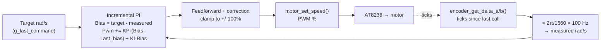

# Control Tuning & Calibration (`mdp_stm32`)

Closed-loop wheel-speed PID theory, servo range/steering calibration, and the IMU → `ros2_control`
→ `robot_localization` data flow. For hands-on bench-tuning steps, see
[Overview: Bench-Tuning the Motor PID](index.md#bench-tuning-the-motor-pid).

---

## Closed-Loop Wheel Speed Control

A dedicated `TIM7` ISR runs at 100Hz and closes the loop per wheel:


<p align="center"><strong>Fig. 3</strong> — Wheel-Speed PID Loop (per wheel)</p>

The loop accumulates a PI correction from error changes and adds it to the speed-based
feedforward baseline. Correction and final PWM output are clamped; this is not an explicit
output slew-rate limiter.

The safety layers wrap the loop and always win: the 500ms stale-command fail-safe
(`uart_command_is_stale`) and the `PD3` motor switch check zero the PWM output unconditionally,
ahead of/around the PID — the PID can never override those.

`MOTOR_PID_KP=4.0f`/`MOTOR_PID_KI=0.5f` are untuned placeholder gains — see
[Bench-Tuning the Motor PID](index.md#bench-tuning-the-motor-pid) for the tuning procedure.

**Limitation**: matching each wheel's own encoder-measured rad/s doesn't guarantee equal *real*
ground speed — different effective wheel radius/tire wear/alignment is invisible to the encoder.
A perfectly-tuned PID can still leave the car curving on a straight command — see
[Wheel-speed trim](#wheel-speed-trim) below.

### Wheel-speed trim

Not implemented — only add if the car still visibly curves on a straight `/cmd_vel` command *after*
the PID is bench-tuned and each wheel is confirmed tracking its own target correctly. If it drives
straight once tuned, skip this.

If needed: two constants, `MOTOR_LEFT_TRIM`/`MOTOR_RIGHT_TRIM` (default `1.0f`, neutral), applied to
`left_rad_s`/`right_rad_s` before `motor_pid_set_target()` — adjusts what the PID is asked to track,
not the PID itself. Tuned by feel: drive straight, see which way it curves, nudge the trim on the
lagging side, repeat.

---

## Servo Range & Steering Calibration

Everything in this section was measured on this chassis on 2026-09-11. It replaces an earlier
record that was substantially wrong — see [What the earlier record got wrong](#what-the-earlier-record-got-wrong)
at the end, kept deliberately as a correction trail.

### Measured values

| | Pulse width | Real wheel angle | How it was found |
| --- | --- | --- | --- |
| Straight ahead | **1490 µs** | 0° | Motors off, car pushed by hand at candidate pulses until it rolled straight |
| Full left | **840 µs** | **+35.0°** (0.6109 rad) | Protractor at the wheel; limit is the wheel contacting the chassis |
| Full right | **2400 µs** | **−29.5°** (−0.5149 rad) | Protractor at the wheel; *not* a confirmed mechanical limit, see below |

Sign convention is REP-103: **positive = left**, negative = right. Confirmed on physical hardware
(observer behind the robot, facing the direction of travel). The servo's wiring and linkage already
agree with the ROS convention, so no sign translation happens anywhere in the stack — `mdp_bridge`
passes `steer_rad` through unmodified.

Center is **not** the nominal 1500 µs. At 1500 µs the car curved right when pushed by hand; 1490 µs
rolls straight. The hand push is what makes this measurement trustworthy — with the motors off,
neither wheel speed nor the PID can contribute, so anything left is steering geometry. A powered run
cannot distinguish a steering-center offset from a wheel-speed mismatch, since both curve the car.

### Real-angle → pulse mapping

`servo_set_angle(float angle_rad)` takes a **real wheel angle** — the same quantity the URDF and
`ackermann_steering_controller` mean. It interpolates linearly between center and the measured lock
point, with a **separate slope per side**:

```c
left  (angle >= 0):  pulse = 1490 + angle_rad × (−1064.1)   /* 1490 → 840 µs over  35.0° */
right (angle <  0):  pulse = 1490 + angle_rad × (−1767.4)   /* 1490 → 2400 µs over 29.5° */
```

Spans are 650 µs left and 910 µs right, so the two sides differ by roughly 1.4× — a single shared
slope cannot serve both. Real-angle resolution works out at ~0.054°/µs left and ~0.032°/µs right,
against `TIM12`'s 1 µs tick (`PSC=83` on the 84 MHz `TIM12CLK` gives a 1 MHz counter, so `CCR` *is*
the pulse width in microseconds).

Consequence worth noting: because the angle argument now means a real angle, `mdp_bridge`'s
straight pass-through of `steer_rad` is finally correct. Previously the controller's real angle was
fed into a differently-scaled unit, which under-steered left and clipped right. No bridge change was
needed to fix it.

#### Why WHEELTEC's cubic was retired

The previous implementation used WHEELTEC's reference cubic fit (`R550_C30D(2.0)` chassis source,
`BALANCE/balance.c`, `Drive_Motor()`'s `Akm_Car` branch):

```c
Angle_Servo = -0.628*a^3 + 1.269*a^2 - 1.772*a + 1.573;
Servo_us    = 1500 + (Angle_Servo - 1.572) * 636.56;   /* clamped 800-2200us */
```

It was adopted on the assumption that its input meant a real wheel angle, as it does in their
firmware — their `AngleR` feeds `R = wheelbase/tan(AngleR)`, real Ackermann geometry. Protractor
measurement disproved that here: at 840 µs the cubic's input reads 52.3° while the wheel actually
sits at 35.0°, an overstatement of roughly 1.5×. Every "commanded angle" recorded under it was
therefore a curve input, not an angle.

Its `800-2200µs` clamp was independently harmful. It sat 200 µs *inside* this chassis's right-hand
travel, and the cubic reaches 2200 µs at only ~−25.6° of its own input — so every sweep step past
that point sent an identical pulse. That is what produced the old "right stall at 26°" finding: the
firmware stopped commanding further, and the hardware was never asked.

### Calibration tooling

`selftest.c` provides button-advanced sweeps (one PE0 press per step, pulse width shown on the OLED).
Press PE0 during normal operation to run the self-test; no reset is needed, and the motor switch must
be enabled for it to proceed. Only the straight-line PI test is currently enabled;
calibration sweeps must be uncommented in `selftest_run()` before use.

| Phase | Purpose |
| --- | --- |
| `servo_straight_line_pid()` | Drives straight *through the PID loop*, showing both wheels' measured rad/s against target. The older `drive_ticks()` phases write open-loop PWM with the loop paused and cannot test it. |
| `servo_cal_center_trim()` | Steps the pulse down from 1500 µs, holding each step indefinitely with no timeout or auto-recenter, so the car can be hand-pushed repeatedly and power cut at the value that rolls straight. |
| `servo_cal_left_limit()` / `servo_cal_right_limit()` | Step outward from a known-safe pulse to find mechanical limits. |
| `servo_cal_verify_points()` | Drives to recorded `(pulse, angle)` points for re-measurement. |
| `servo_cal_measure()` | Coarse sweep across the range for protractor work at intermediate angles. |

**Calibrate in microseconds, never in an "angle" unit.** Microseconds is the only unit in the driver
that is physically meaningful on its own — it is the actual signal the servo receives. Calibrating
against a mapping's own input unit is circular, which is precisely how the cubic's numbers went
unchallenged for so long. `servo_set_pulse_us()` exists for this and bypasses the angle-to-pulse mapping and operating
angle clamp; it is bounded only by `SERVO_CAL_PULSE_MIN/MAX_US`
(600–2500 µs), deliberately wider than the operating range so sweeps can probe past current limits.

When judging a limit, watch *and* listen. A servo stall is an audible buzz or whine with no visible
motion; chassis or linkage contact is the wheel or knuckle visibly binding while the servo still
strains. The limit is the last step that moved cleanly, not the one that stalled.

### Still open

- :warning: **Which wheel each reading came from was not recorded.** One servo drives both front
  wheels through a shared tie-rod, so a given wheel is the inner wheel in one turn direction and the
  outer in the other, and Ackermann geometry steers the inner harder by design. The 35.0° vs 29.5°
  gap may therefore be inner-vs-outer rather than left-vs-right. Four readings settle it: both wheels
  at both locks. Until then the URDF's `left_joint`/`right_joint` both carry the same pair of limits,
  which is known to be not strictly correct.
- :warning: **The right limit is not confirmed.** 2400 µs was the calibration ceiling at the time and
  the wheel was still tracking when it was reached — the same mistake the old 2200 µs bound made.
  `SERVO_CAL_PULSE_MAX_US` is now 2500 µs and `servo_cal_right_limit()` sweeps 2380–2500 µs to settle
  it. 2500 µs is where this stops regardless: past it a servo's internal feedback pot can be driven
  out of range.
- :warning: **Mid-range linearity is assumed, not measured.** Only center and the two lock points are
  known, so intermediate angles carry unknown error — and mid-range is exactly where the nonlinearity
  the cubic was modelling would show up. Fix: measure intermediate points with `servo_cal_measure()`
  and fit per side. A circle test (command a fixed mid-range angle, drive a full circle, compare the
  measured radius against `wheelbase / tan(angle)`) validates it end-to-end, though it depends on the
  wheelbase value in `ackermann_controller.yaml` (`0.1433`), itself unverified.
- The `HWZ020`'s datasheet-rated ±22.35° describes the servo's own internal travel, not the angle
  this linkage achieves at the wheel. The chassis-measured values above are what govern operation.

### What the earlier record got wrong

Kept as a correction trail, because two of these were fabrications rather than honest errors and the
numbers had propagated into code that drives the robot.

- **A protractor session that never happened.** This document and the URDF both described "8 raw
  readings across 2 measurement sessions" yielding a mode of 32.5°, symmetric on both sides. No such
  measurement was performed. The figure was wrong in both magnitude and shape — real left lock is
  35.0°, and the two sides are not symmetric. It had been driving
  `ackermann_steering_controller`'s turning-radius math.
- **"Commanded" values recorded as if they were angles.** The old limits of 41°/27°, and later
  48°/24°, were inputs to WHEELTEC's cubic, not wheel angles. They are not comparable to the real
  values above and must not be reintroduced: fed through the current mapping, "48°" would command
  ~595 µs, far past the 840 µs chassis-contact point.
- **A mechanical limit that was a firmware clamp.** "Right stall at 26°" was the 800–2200 µs clamp
  saturating, not the linkage.
- **An asymmetry blamed on the chassis.** The 48°/24° gap was attributed to asymmetric Ackermann
  knuckles. It was the cubic's own curve shape — its slope varies about 3× across the range. (The
  sides *are* genuinely asymmetric, 650 µs vs 910 µs, but that is a different and much smaller
  effect, and possibly inner-vs-outer as noted above.)
- **Two sections describing a mapping that no longer existed.** "Command resolution" and "Raw PWM
  pulse range and real-world angular precision" documented a linear mapping via
  `SERVO_ANGLE_SCALE_RAD` and a 600–2400 µs range, constants long since gone from the code, and
  quoted a 2320 µs pulse that exceeded the then-active 2200 µs ceiling. Both are removed; the
  accurate resolution figures are under [Real-angle → pulse mapping](#real-angle--pulse-mapping).

---

## IMU → `ros2_control` → `robot_localization` Data Flow

### What should run where

```
STM32 (mdp_stm32)                    Pi (mdp_ros)
------------------                   ------------
imu_update():                        serial_bridge_node:
  read raw accel_x/y/z,     ----->     publish sensor_msgs/Imu:
  gyro_x/y/z over I2C2                   angular_velocity  (raw gyro, rad/s)
  (ICM-20948 registers                   linear_acceleration (raw accel, m/s^2)
  0x2D-0x38 only — no mag)               [orientation: see below]
                                                |
                                                v
                                      robot_localization ekf_node:
                                        fuses angular_velocity_z (yaw rate)
                                        + ackermann_steering_controller's
                                        v_x (wheel odometry)
                                        -> /odometry/filtered, odom->base_link TF
```

### The current mismatch

The firmware integrates `gyro_z` into `yaw_deg` itself (naive, one-time startup bias calibration
only, no drift correction) and the bridge publishes that as a full orientation quaternion with a
low covariance on z ("trust this yaw"). If `ekf.yaml`'s `imu0_config` is set to fuse `orientation`,
the EKF is just accepting the MCU's un-corrected dead-reckoning directly — the drift-prone
integration happened on the *wrong* side of the link, and the EKF isn't adding any filtering value
for yaw at all in that configuration.

### Fix applied (config-only)

- :white_check_mark: `ekf.yaml`'s `imu0_config` now fuses only `angular_velocity_z`, `orientation`
  fusion turned off. The EKF integrates yaw itself, weighted against wheel-odometry heading from
  `ackermann_steering_controller`, with proper process-noise modeling — that's the actual purpose of
  running an EKF instead of trusting one sensor's raw integration. **Not yet re-validated on
  physical hardware** — re-run the `robot_localization` on-hardware check next time the robot's up.
- `g_imu_data.yaw`/the orientation quaternion in `serial_bridge_node.cpp` are now dead weight from
  the EKF's perspective (nothing consumes `orientation` anymore) but are left in place for now —
  still useful for OLED display / debugging telemetry. Not removed as part of this change.

### Why not fuse the magnetometer today

The ICM-20948 has an onboard AK09916 magnetometer, but `imu.c` never reads it (only accel+gyro
registers). Gyro-only yaw — whether integrated on the MCU or in the EKF — drifts unbounded with no
absolute reference to correct against. Adding mag support is real new work: extra I2C reads in
`imu.c`, publishing `sensor_msgs/MagneticField`, and typically running something like
`imu_filter_madgwick` upstream of the EKF to turn gyro+accel+mag into a single filtered orientation
(feeding raw mag straight into `robot_localization` isn't the normal pattern). Worth it for long
runs; likely unnecessary for short MDP checkpoint-to-checkpoint hops where drift over ~30s is small.

Also notable: WHEELTEC's own reference firmware doesn't do a software complementary/Madgwick filter
either — the MPU6050 they primarily target has a **hardware DMP** (`Read_DMP()` in `balance.c`) that
outputs a fused quaternion directly from the sensor's own onboard processor. The ICM-20948 used on
this board has an equivalent DMP, but this project's driver is a from-scratch bit-banged I2C
register reader that never touches it — using the DMP would mean uploading Invensense's DMP firmware
blob and talking to a much larger register/FIFO interface, a significant driver rewrite, not a small
addition. The EKF-side fusion recommended above is the practical path with the current driver.
